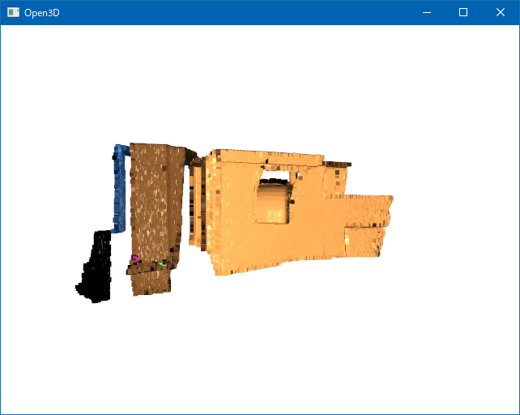

# DBSCAN

## Abstracts

* Clustering sample point cloud data and visualize

## Requirements

### Common

* Powershell
* CMake 3.0.0 or later
* C++ Compiler supports C++17

### Windows

* Visual Studio

### Linux

* Ubuntu 20.04 or later
* glibc 2.31 or later
* OpenGL
  * `sudo apt-get install -y libglu1-mesa-dev freeglut3-dev mesa-common-dev libc++-dev`

## How to build?

Go to [C++](..).

At first, you must download prebuilt binaries.

````shell
$ pwsh download.ps1
````

After that, script generates artifacts so you can run the following command.

````shell
$ pwsh build.ps1 <Debug/Release> <Open3D version>
````

## How to use?

#### Windows

````bat
$ install\win\bin\Demo.exe
Precompute neighbors.[========================================] 100%
[Info] Number of clusters detected: 10============>] 97%
````

#### Linux

````bat
$ export LD_LIBRARY_PATH=${LD_LIBRARY_PATH}:install/linux/bin
$ ./install/linux/bin/Demo
Precompute neighbors.[========================================] 100%
[Info] Number of clusters detected: 10============>] 97%
````

