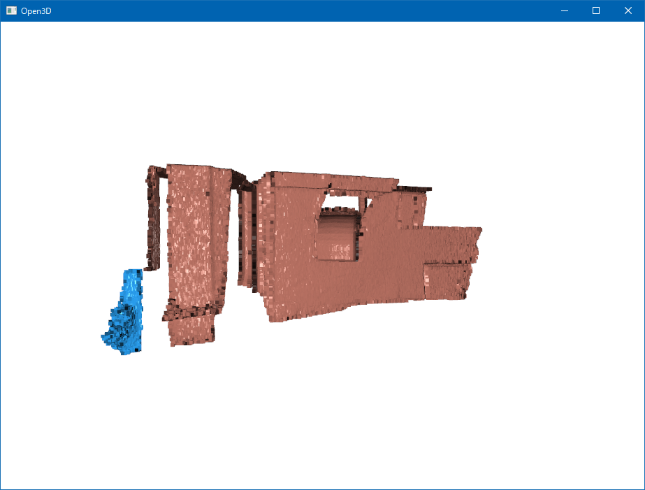

# DBSCAN

## Abstracts

* Clustering sample point cloud data and visualize

## Requirements

### Common

* Python 3.7 or later

## Dependencies

* [open3d](https://github.com/isl-org/Open3D)
  * v0.18.0
  * MIT license

## How to build?

### Virtual Environmental

Go to [Open3D](..).

## How to test?

#### Windows

````bat
$ python main.py
````

#### Linux

````shell
$ python main.py
````

#### OSX

````shell
$ python main.py
````

