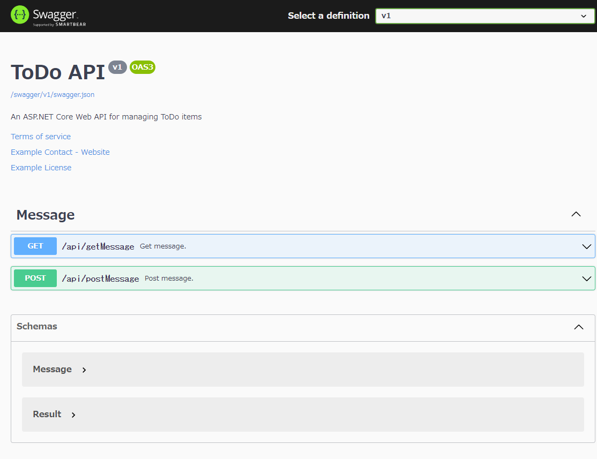

# Simple WebAPI (with Swagger)

## Abstracts

* How to create simple web api by using Swagger
* You can change property name of model by using `JsonPropertyName`
* You can generate api comments by using xml document

## Requirements

* .NET 6.0 SDK

## How to use?

````powershell
dotnet run -c Release -- --urls http://localhost:5000
info: Microsoft.Hosting.Lifetime[14]
      Now listening on: http://localhost:5000
info: Microsoft.Hosting.Lifetime[0]
      Application started. Press Ctrl+C to shut down.
info: Microsoft.Hosting.Lifetime[0]
      Hosting environment: Development
info: Microsoft.Hosting.Lifetime[0]
      Content root path: D:\Works\OpenSource\Demo\ASP.NET\01.Swagger\
````

or

````powershell
dotnet run -c Release
info: Microsoft.Hosting.Lifetime[14]
      Now listening on: https://localhost:7262
info: Microsoft.Hosting.Lifetime[14]
      Now listening on: http://localhost:5287
info: Microsoft.Hosting.Lifetime[0]
      Application started. Press Ctrl+C to shut down.
info: Microsoft.Hosting.Lifetime[0]
      Hosting environment: Development
info: Microsoft.Hosting.Lifetime[0]
      Content root path: D:\Works\OpenSource\Demo\ASP.NET\01.Swagger\
````

## Result

[](./images/preview.png)
