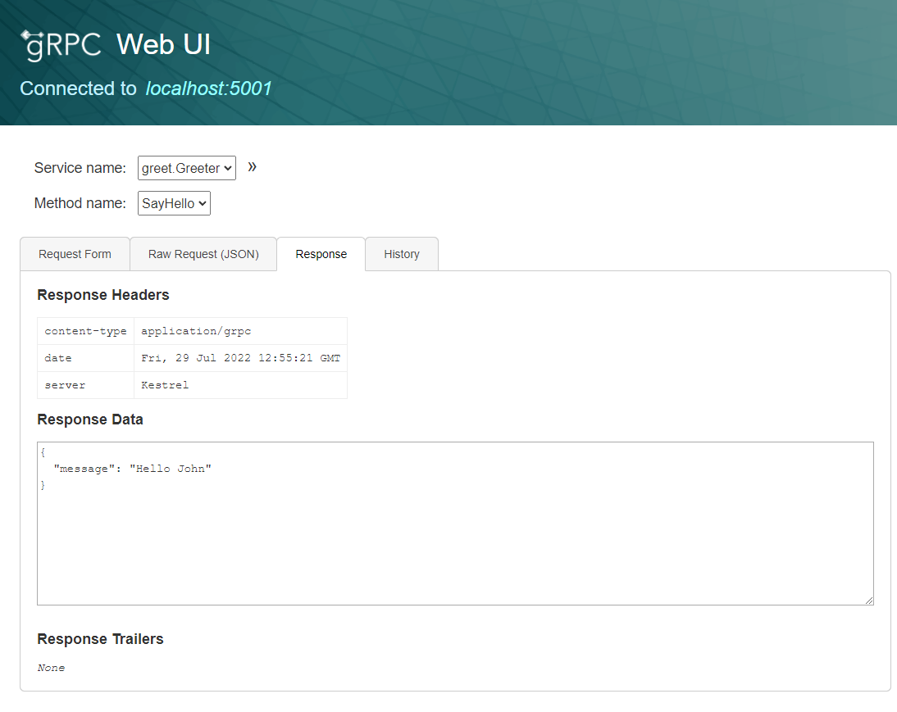

# gRPC

## Abstacts

* How to use gRPC service on ASP.NET

## Requirements

* Visual Studio 2022
* .NET 6.0 SDK

## Dependencies

* [Grpc.AspNetCore](https://github.com/grpc/grpc-dotnet)
  * Apache License 2.0
* [Grpc.AspNetCore.Server.Reflection](https://github.com/grpc/grpc-dotnet)
  * Apache License 2.0
* [NLog](https://github.com/NLog/NLog)
  * BSD-3-Clause License
* [NLog.Web.AspNetCore](https://github.com/NLog/NLog.Web)
  * BSD-3-Clause License

### For Test Only

* [grpcui](https://github.com/fullstorydev/grpcui)
   * MIT License
* [gRPCurl](https://github.com/fullstorydev/grpcurl)
   * MIT License

## How to use?

### Run on Kestrel

````powershell
$ dotnet run -c Release --project sources\Demo\Demo.csproj
````

And you can invoke gRPC interface by [gRPCurl](https://github.com/fullstorydev/grpcurl).

````powershell
$ tools\grpcurl\1.8.6\grpcurl-win.exe -d '{ \"name\": \"World\" }' localhost:5001 greet.Greeter/SayHello
{
  "message": "Hello World"
}
````

### Interact with WebUI

````powershell
$ dotnet run -c Debug --project sources\Demo\Demo.csproj
````

And 

````powershell
$ tools\grpcui\v1.3.0\grpcui-win.exe localhost:5001
````

[](./images/webui.png)