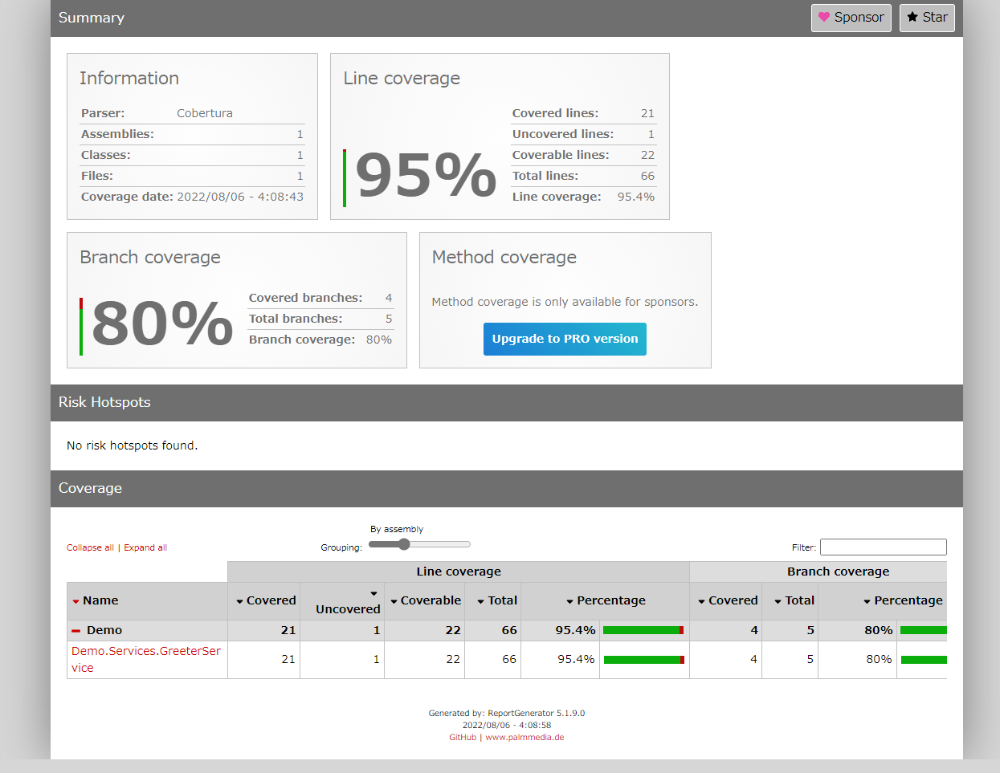

# gRPC with integrated test

## Abstracts

* How to test gRPC service as unit test and integrated test
  * Base code comes from https://github.com/grpc/grpc-dotnet/tree/master/test/FunctionalTests

## Requirements

* Visual Studio 2022
* .NET 6.0 SDK
* PowerShell Core 6.2 or later

## Dependencies

* [Grpc.AspNetCore](https://github.com/grpc/grpc-dotnet)
  * Apache License 2.0
* [Grpc.AspNetCore.Server.Reflection](https://github.com/grpc/grpc-dotnet)
  * Apache License 2.0
* [NLog](https://github.com/NLog/NLog)
  * BSD-3-Clause License
* [NLog.Web.AspNetCore](https://github.com/NLog/NLog.Web)
  * BSD-3-Clause License

### for Test only

* [converlet.coolector](https://github.com/coverlet-coverage/coverlet)
  * MIT License
* [Grpc.Core.Testing](https://github.com/grpc/grpc)
  * Apache License 2.0
* [Grpc.Net.Client](https://github.com/grpc/grpc-dotnet)
  * Apache License 2.0
* [Microsoft.AspNetCore.TestHost](https://github.com/dotnet/aspnetcore)
  * MIT License
* [Microsoft.NET.Test.Sdk](https://github.com/microsoft/vstest/)
  * MIT License
* [Moq](https://github.com/moq/moq4)
  * BSD-3-Clause License
* [xunit](https://github.com/xunit/xunit)
  * Apache License 2.0
* [xunit.runner.visualstudio](https://github.com/xunit/visualstudio.xunit)
  * MIT License

## How to use

````bat
$ dotnet run -c Release --project sources\Demo\Demo.csproj
````

### gRPC Web UI

````bat
$ tools\grpcui\windows\v1.3.0\grpcui.exe localhost:5001
````

## How to test

### Unit Test

````bat
$ dotnet test "tests\Demo.UnitTest\Demo.UnitTest.csproj" -c Release --collect "XPlat Code Coverage" --settings tests\Demo.UnitTest\coverage-config.xml
  復元対象のプロジェクトを決定しています...
  復元対象のすべてのプロジェクトは最新です。
  Demo -> E:\Works\OpenSource\Demo\ASP.NET\05_gRPC-integrated-test\sources\Demo\bin\Release\net6.0\Demo.dll
  Demo.UnitTest -> E:\Works\OpenSource\Demo\ASP.NET\05_gRPC-integrated-test\tests\Demo.UnitTest\bin\Release\net6.0\Demo.UnitTest.dll
E:\Works\OpenSource\Demo\ASP.NET\05_gRPC-integrated-test\tests\Demo.UnitTest\bin\Release\net6.0\Demo.UnitTest.dll (.NETCoreApp,Version=v6.0) のテスト実行
Microsoft (R) Test Execution Command Line Tool Version 17.2.0 (x64)
Copyright (c) Microsoft Corporation.  All rights reserved.

テスト実行を開始しています。お待ちください...
合計 1 個のテスト ファイルが指定されたパターンと一致しました。

添付ファイル:
  E:\Works\OpenSource\Demo\ASP.NET\05_gRPC-integrated-test\tests\Demo.UnitTest\TestResults\84cb6a40-56f8-4bee-9d19-b73151f0f3c0\coverage.cobertura.xml
成功!   -失敗:     0、合格:     4、スキップ:     0、合計:     4、期間: 9 ms - Demo.UnitTest.dll (net6.0)
````

`tests\Demo.UnitTest\coverage-config.xml` defines coverage rule.
In this file, some classes are exluded from coverage result.

#### Output Test Report

After this, you can see test report in `coveragereport`.

````bat
$ dotnet tool install -g dotnet-reportgenerator-globaltool
$ reportgenerator -reports:"tests\Demo.UnitTest\TestResults\{guid}\coverage.cobertura.xml" -targetdir:"coveragereport" -reporttypes:Html
````

[](./images/report.png)

### Integrated Test

````bat
$ pwsh GeneratePrrotoCode.ps1
$ dotnet test "tests\Demo.IntegratedTest\Demo.IntegratedTest.csproj" -c Release
  復元対象のプロジェクトを決定しています...
  復元対象のすべてのプロジェクトは最新です。
  Demo -> E:\Works\OpenSource\Demo\ASP.NET\05_gRPC-integrated-test\sources\Demo\bin\Release\net6.0\Demo.dll
  Demo.IntegratedTest -> E:\Works\OpenSource\Demo\ASP.NET\05_gRPC-integrated-test\tests\Demo.IntegratedTest\bin\Release\net6.0\Demo.IntegratedTest.dll
E:\Works\OpenSource\Demo\ASP.NET\05_gRPC-integrated-test\tests\Demo.IntegratedTest\bin\Release\net6.0\Demo.IntegratedTest.dll (.NETCoreApp,Version=v6.0) のテスト実行
Microsoft (R) Test Execution Command Line Tool Version 17.2.0 (x64)
Copyright (c) Microsoft Corporation.  All rights reserved.

テスト実行を開始しています。お待ちください...
合計 1 個のテスト ファイルが指定されたパターンと一致しました。

成功!   -失敗:     0、合格:     1、スキップ:     0、合計:     1、期間: < 1 ms - Demo.IntegratedTest.dll (net6.0)
````