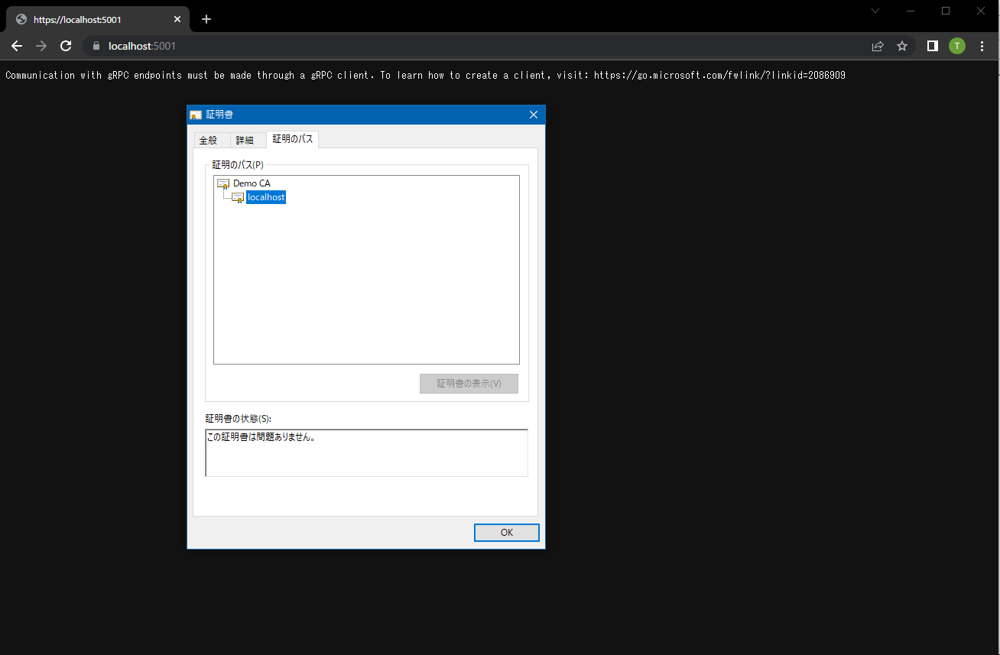

# gRPC Benchmark

## Abstracts

* Benchmark performance of Grpc.Core and Grpc.Net.Client
  * Include https and http

## Requirements

* Visual Studio 2022
* .NET 6.0 SDK
* PowerShell Core 6.2 or later

## Dependencies

* [Google.Protobuf](https://github.com/protocolbuffers/protobuf)
  * BSD-3-Clause License
* [Grpc.AspNetCore](https://github.com/grpc/grpc-dotnet)
  * Apache License 2.0
* [Grpc.AspNetCore.Server.Reflection](https://github.com/grpc/grpc-dotnet)
  * Apache License 2.0
* [Grpc.Core](https://github.com/grpc/grpc)
  * Apache License 2.0
* [Grpc.Net.Client](https://github.com/grpc/grpc-dotnet)
  * Apache License 2.0
* [NLog](https://github.com/NLog/NLog)
  * BSD-3-Clause License
* [NLog.Web.AspNetCore](https://github.com/NLog/NLog.Web)
  * BSD-3-Clause License

## How to use

Create proto files

````bat
$ pwsh GenerateGrpc.ps1
````

Create certificate files

````bat
$ pwsh CreateCertificate.ps1
````

Then, import root ca file

````bat
$ powershell Import-Certificate -FilePath ca.crt -CertStoreLocation Cert:\LocalMachine\Root
   PSParentPath: Microsoft.PowerShell.Security\Certificate::LocalMachine\Root

Thumbprint                                Subject
----------                                -------
1DB70BF1B0293C9E01B0D940A94D9F4936722D08  CN=Demo CA, O=Demo CA Corporation, L=MINATO-KU, C=JP
````

## How to test

At first, start server

````bat
$ dotnet run -c Release --project sources\Server\Server.csproj
````

You can see Google Chrome have succeeded to verify self signed certificates.



Then, run script

````bat
$ pwsh Run.ps1
Test E:\Works\OpenSource\Demo\ASP.NET\06_gRPC-benchmark\sources\Client
 UseSsl: True
  Count: 1000
 Length: 10000000
  Total: 45762 ms
Average: 45.762 ms
 UseSsl: False
  Count: 1000
 Length: 10000000
  Total: 23844 ms
Average: 23.844 ms
Test E:\Works\OpenSource\Demo\ASP.NET\06_gRPC-benchmark\sources\LegacyClient
 UseSsl: True
  Count: 1000
 Length: 10000000
  Total: 37011 ms
Average: 37.011 ms
 UseSsl: False
  Count: 1000
 Length: 10000000
  Total: 23717 ms
Average: 23.717 ms
````