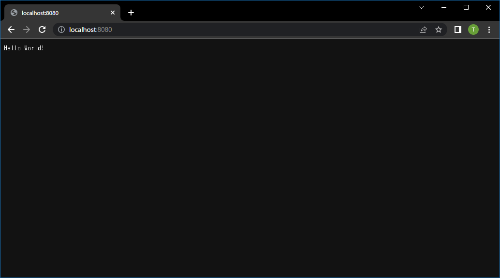

# Run WebApp in docker container

## Abstacts

* How to deploy web application into container

## Requirements

* .NET 6.0 SDK
* PowerShell Core 6.2 or later
* docker

## Dependencies

N/A

## How to use

````shell
$ pwsh Build.ps1
$ pwsh Run.ps1
````

Then, open http://localhost:8080

