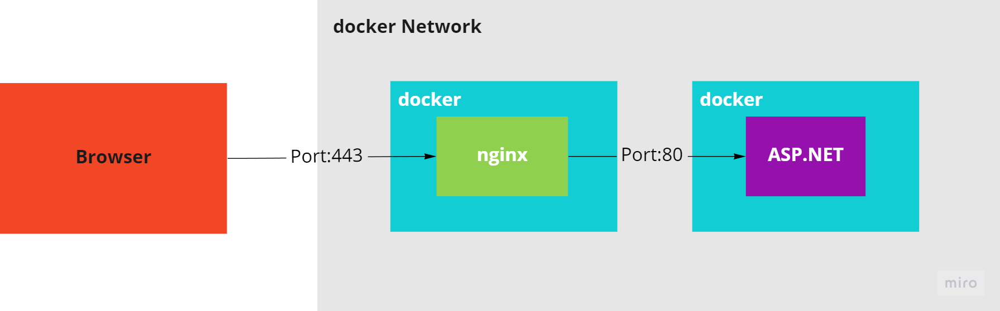
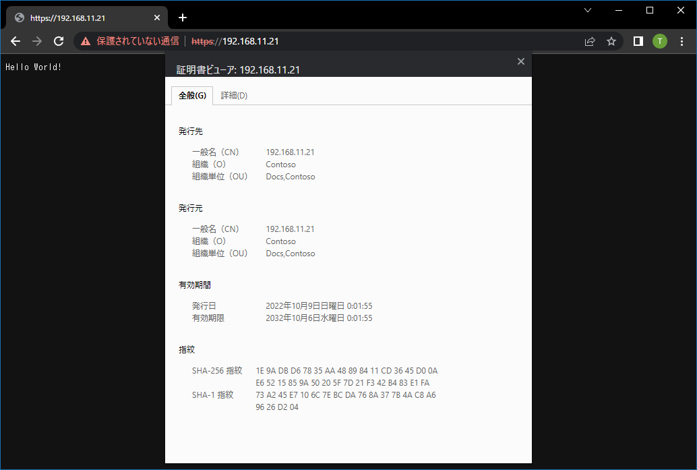
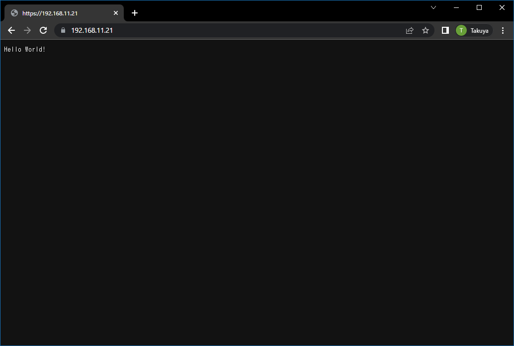

# Run WebApp in docker container with nginx (SSL)

## Abstracts

* How to deploy web application into container
* Enable SSL (IP Address)
  * You can check [10_GenerateCertificateIPAddress](../../Misc/10_GenerateCertificateIPAddress)



The above diagram is generatead by [Miro](https://miro.com)

## Requirements

* .NET 6.0 SDK
* PowerShell Core 6.2 or later
* docker and docker-compose

## Dependencies

* [nginx](https://github.com/nginx/nginx)
  * BSD 2-Clause License

## How to use

You must generate certificates by using [10_GenerateCertificateIPAddress](../../Misc/10_GenerateCertificateIPAddress).

For example,

````shell
$ cd ../../Misc/10_GenerateCertificateIPAddress
$ pwsh Generate.ps1 192.168.11.21
````

And copy `server.crt` and `server.key` into [09_docker-sample-with-nginx_ssl](../09_docker-sample-with-nginx_ssl).

Then,

````shell
$ pwsh Build.ps1
$ pwsh Run.ps1
````

After this, open http://192.168.11.21



And you can see that you can access to WebApp via nginx.

````shell
$ docker logs -f docker-sample-nginx
/docker-entrypoint.sh: /docker-entrypoint.d/ is not empty, will attempt to perform configuration
/docker-entrypoint.sh: Looking for shell scripts in /docker-entrypoint.d/
/docker-entrypoint.sh: Launching /docker-entrypoint.d/10-listen-on-ipv6-by-default.sh
10-listen-on-ipv6-by-default.sh: info: Getting the checksum of /etc/nginx/conf.d/default.conf
10-listen-on-ipv6-by-default.sh: info: /etc/nginx/conf.d/default.conf differs from the packaged version
/docker-entrypoint.sh: Launching /docker-entrypoint.d/20-envsubst-on-templates.sh
/docker-entrypoint.sh: Launching /docker-entrypoint.d/30-tune-worker-processes.sh
/docker-entrypoint.sh: Configuration complete; ready for start up
2022/10/08 15:08:07 [notice] 1#1: using the "epoll" event method
2022/10/08 15:08:07 [notice] 1#1: nginx/1.22.0
2022/10/08 15:08:07 [notice] 1#1: built by gcc 11.2.1 20220219 (Alpine 11.2.1_git20220219)
2022/10/08 15:08:07 [notice] 1#1: OS: Linux 4.19.128-microsoft-standard
2022/10/08 15:08:07 [notice] 1#1: getrlimit(RLIMIT_NOFILE): 1048576:1048576
2022/10/08 15:08:07 [notice] 1#1: start worker processes
2022/10/08 15:08:07 [notice] 1#1: start worker process 31
2022/10/08 15:08:07 [notice] 1#1: start worker process 32
2022/10/08 15:08:07 [notice] 1#1: start worker process 33
2022/10/08 15:08:07 [notice] 1#1: start worker process 34
2022/10/08 15:08:07 [notice] 1#1: start worker process 35
2022/10/08 15:08:07 [notice] 1#1: start worker process 36
2022/10/08 15:08:07 [notice] 1#1: start worker process 37
2022/10/08 15:08:07 [notice] 1#1: start worker process 38
2022/10/08 15:08:07 [notice] 1#1: start worker process 39
2022/10/08 15:08:07 [notice] 1#1: start worker process 40
2022/10/08 15:08:07 [notice] 1#1: start worker process 41
2022/10/08 15:08:07 [notice] 1#1: start worker process 42
172.18.0.1 - - [08/Oct/2022:15:08:20 +0000] "GET / HTTP/1.1" 200 22 "-" "Mozilla/5.0 (Windows NT 10.0; Win64; x64) AppleWebKit/537.36 (KHTML, like Gecko) Chrome/105.0.0.0 Safari/537.36" "-"
172.18.0.1 - - [08/Oct/2022:15:08:20 +0000] "GET /favicon.ico HTTP/1.1" 404 0 "https://192.168.11.21/" "Mozilla/5.0 (Windows NT 10.0; Win64; x64) AppleWebKit/537.36 (KHTML, like Gecko) Chrome/105.0.0.0 Safari/537.36" "-"
````

Of course, certification is invalid because it is self-signed certificate.
So You can import `ca.crt` generated by Generate.ps1 into `Trusted Root Certification Authorities` and this warning goes away.
After import `ca.crt`, you should reboot browser.

