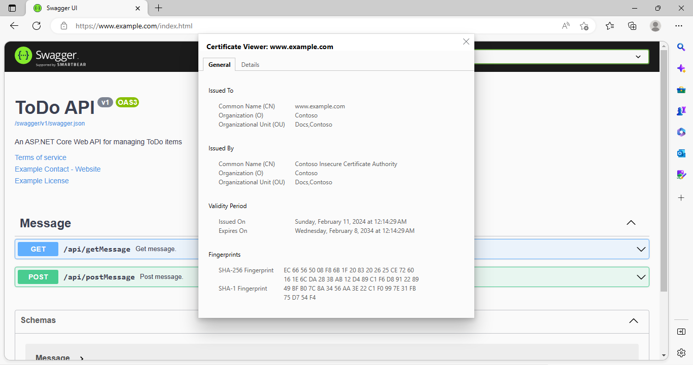

# Secured Swagger WebAPI (with self signed certificate)

## Abstracts

* How to create simple web api by using Swagger
* How to use self signed certificate on ASP.NET

## Requirements

* .NET 8.0 SDK

## Dependencies

* [Swashbuckle.AspNetCore](https://github.com/domaindrivendev/Swashbuckle.AspNetCore)
  * MIT license

## How to use?

You must generate certificates by using [17_GenerateSelfCertificateCustomDomain](../../Misc/17_GenerateSelfCertificateCustomDomain).
For example,

````pwoershell
$ pwsh Generate.ps1 www.example.com
````

After that, copy `certs/server.pfx` into [10_Swagger-with-ssl](10_Swagger-with-ssl).
And install `certs/ca.crt` to `Trusted Root Certification Authority store` by following command.

````powershell
$ certutil.exe -addstore root certs\ca.crt
root "信頼されたルート証明機関"
署名は公開キーと一致します
証明書 "Contoso Insecure Certificate Authority" がストアに追加されました。
CertUtil: -addstore コマンドは正常に完了しました。
````

Then, modify `hosts` file. Speficy localhost ip address and binds it and your domain.
For example,

````txt
127.0.0.1 www.example.com
````

Lastly, run following command to run server

````powershell
$ dotnet run -c Release
ビルドしています...
warn: Microsoft.AspNetCore.Server.Kestrel[0]
      Overriding address(es) 'https://localhost:7262, http://localhost:5287'. Binding to endpoints defined via IConfiguration and/or UseKestrel() instead.
info: Microsoft.Hosting.Lifetime[14]
      Now listening on: http://[::]:80
info: Microsoft.Hosting.Lifetime[14]
      Now listening on: https://[::]:443
info: Microsoft.Hosting.Lifetime[0]
      Application started. Press Ctrl+C to shut down.
info: Microsoft.Hosting.Lifetime[0]
      Hosting environment: Development
info: Microsoft.Hosting.Lifetime[0]
      Content root path: E:\Works\OpenSource\Demo\ASP.NET\10_Swagger-with-ssl\
````

## Result

[](./images/preview.png)
