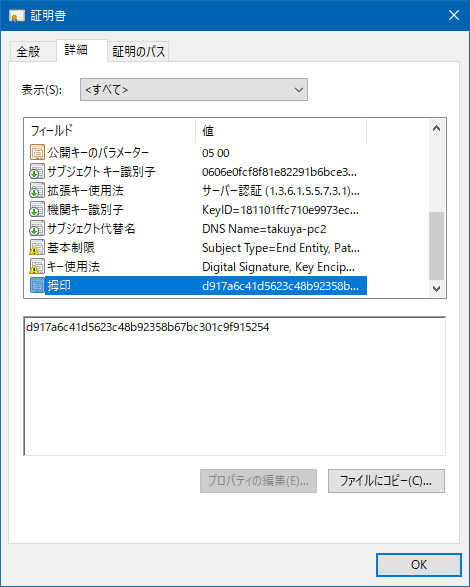
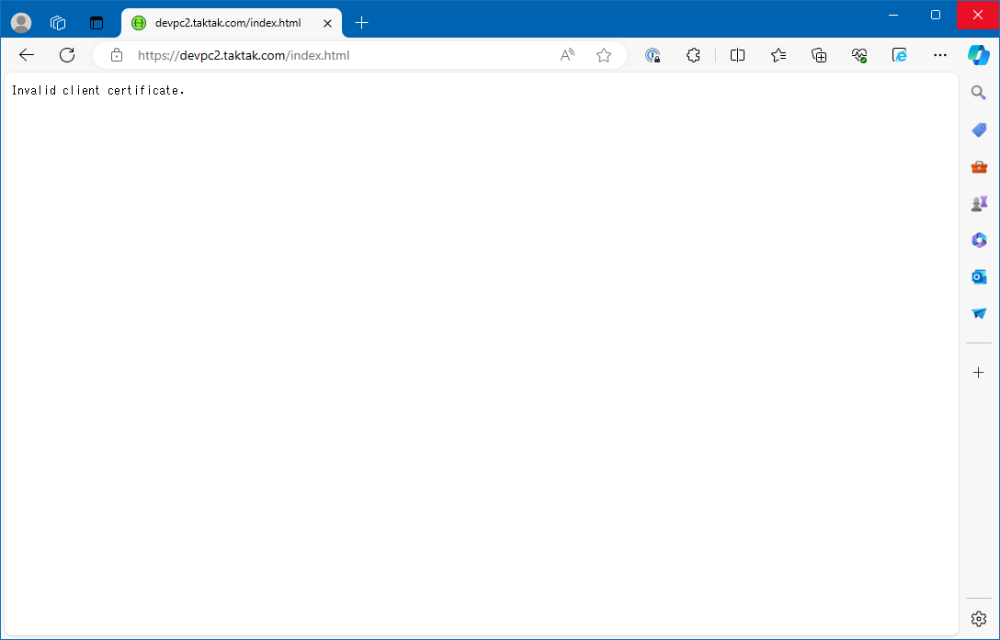

# Mutual TLS

## Abstracts

* How to use Mutual TLS (mTLS) for ASP.NET
  * This sample check thumbprint of client certificate

## Requirements

* .NET 8.0 SDK

## Dependencies

* [Microsoft.AspNetCore.Authentication.Certificate](https://github.com/dotnet/aspnetcore)
  * 8.0.4
  * MIT license
* [Swashbuckle.AspNetCore](https://github.com/domaindrivendev/Swashbuckle.AspNetCore)
  * 6.5.0
  * MIT license

## How to use?

#### 01. Create certificates

First, you need to create server and client certificates.
You can use these scripts

* [Misc/20_PrivateCertificateAuthority](../../Misc/20_PrivateCertificateAuthority)
* [Misc/21_NewCertificateSigningRequest](../../Misc/21_NewCertificateSigningRequest)

#### 02. Config server

Copy `server.pfx` to [server.pfx](./sources/Server/certs/server.pfx) and modify `Pasword` section in [appsettings.json](sources/Server/appsettings.json).

````json
"Certificate": {
  "Path": "certs/server.pfx",
  "Password": "p@ssword123"
}
````

Next, change certificate thumbprint to validate in [sources/Server/Program.cs](sources/Server/Program.cs).
You can see thumbprint at here.



````csharp
builder.Services.AddTransient<ICertificateValidator>(provider => new ThumbprintCertificateValidator("d917a6c41d5623c48b92358b67bc301c9f915254"));
````

#### 03. Launch server

````bat
$ cd sources/Server
$ dotnet run -c Release
arn: Microsoft.AspNetCore.Server.Kestrel[0]
      Overriding address(es) 'http://localhost:5234'. Binding to endpoints defined via IConfiguration and/or UseKestrel() instead.
info: Microsoft.Hosting.Lifetime[14]
      Now listening on: http://[::]:80
info: Microsoft.Hosting.Lifetime[14]
      Now listening on: https://[::]:443
info: Microsoft.Hosting.Lifetime[0]
      Application started. Press Ctrl+C to shut down.
info: Microsoft.Hosting.Lifetime[0]
      Hosting environment: Development
info: Microsoft.Hosting.Lifetime[0]
      Content root path: E:\Works\OpenSource\Demo2\ASP.NET\11_MutualTLS\sources\Server
````

You can see Swagger UI but browser show error.



But it is expected behavior.

#### 04. Connect to server

At first, check behavior when not passing client certificate.
1st argument should specify your domain.

````bat
$ cd sources/Client
$ dotnet run -c Release -- https://devpc2.taktak.com/api/Test                                                                                                         
2024-05-02 11:01:00.3557 [INFO ] No certificate 
2024-05-02 11:01:00.5588 [ERROR] Failed to connect System.Net.Http.HttpRequestException: Response status code does not indicate success: 403 (Forbidden).
   at System.Net.Http.HttpResponseMessage.EnsureSuccessStatusCode()
   at Client.Program.Main(String[] args) in E:\Works\OpenSource\Demo2\ASP.NET\11_MutualTLS\sources\Client\Program.cs:line 59
````

Next, check behavior when passing client certificate.
3rd argument is password of client certificate rather than server's.

````bat
$ cd sources/Client
$ dotnet run -c Release -- https://devpc2.taktak.com/api/Test client.pfx password
2024-05-02 11:02:38.7542 [INFO ] Thumbprint: D917A6C41D5623C48B92358B67BC301C9F915254 
2024-05-02 11:02:38.9237 [INFO ] OK
````

Lastly, check behavior when passing client certificate with wrong thumbprint.

````bat
$ cd sources/Client
$ dotnet run -c Release -- https://devpc2.taktak.com/api/Test wrong.pfx password
2024-05-02 11:02:38.7542 [INFO ] Thumbprint: 756F6C3103F1B2E9A87FFD4C1431EB4D8DB36E0C 
2024-05-02 11:04:16.5112 [ERROR] Failed to connect System.Net.Http.HttpRequestException: Response status code does not indicate success: 403 (Forbidden).
   at System.Net.Http.HttpResponseMessage.EnsureSuccessStatusCode()
   at Client.Program.Main(String[] args) in E:\Works\OpenSource\Demo2\ASP.NET\11_MutualTLS\sources\Client\Program.cs:line 59
````