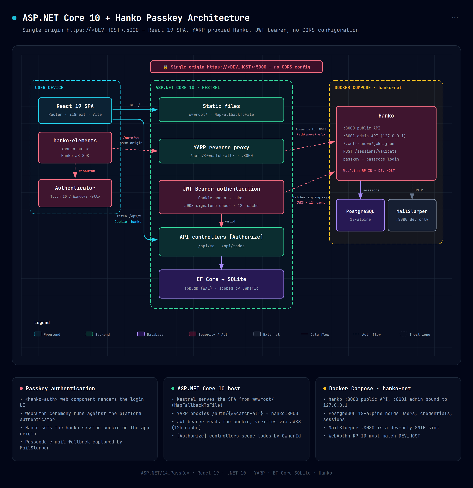
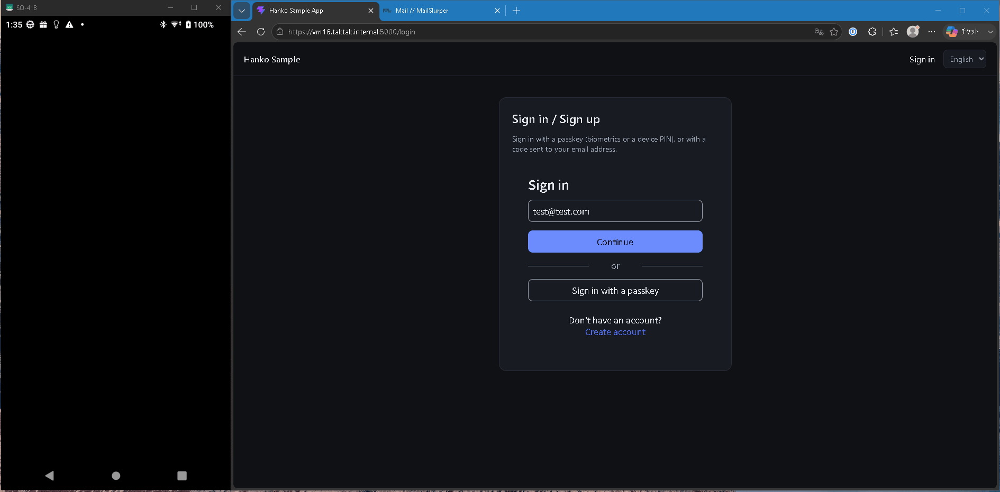

# PassKey

## Abstracts

* Todo Web Application with PassKey login by Hanko
  * Frontend is developped by react
  * Backend is developped by ASP.NET



## Requirements

* .NET 10.0 SDK
* Docker and Docker Compose
* Node
  * 20.x at 20.19.0 or later, or any version from 22.12.0 onward

## Dependencies

#### Backend

* [Microsoft.AspNetCore.Authentication.JwtBearer](https://github.com/dotnet/dotnet)
  * MIT license
* [Microsoft.AspNetCore.OpenApi](https://github.com/dotnet/dotnet)
  * MIT license
* [Microsoft.EntityFrameworkCore.Design](https://github.com/dotnet/dotnet)
  * MIT license
* [Microsoft.EntityFrameworkCore.Sqlite](https://github.com/dotnet/dotnet)
  * MIT license
* [Microsoft.OpenApi](https://github.com/Microsoft/OpenAPI.NET)
  * MIT license
* [SQLitePCLRaw.bundle_e_sqlite3](https://github.com/ericsink/SQLitePCL.raw)
  * Apache-2.0 license
* [SQLitePCLRaw.lib.e_sqlite3](https://github.com/sourcegear/sqlite-builds)
  * Public Domain license
* [Yarp.ReverseProxy](https://github.com/dotnet/yarp)
  * MIT license

#### Frontend

* [@teamhanko/hanko-elements](https://github.com/teamhanko/hanko)
  * MIT license
* [i18next](https://github.com/i18next/i18next)
  * MIT license
* [i18next-browser-languagedetector](https://github.com/i18next/i18next-browser-languageDetector)
  * MIT license
* [react](https://github.com/react/react （packages/react）)
  * MIT license
* [react-dom](https://github.com/react/react （packages/react-dom）)
  * MIT license
* [react-i18next](https://github.com/i18next/react-i18next)
  * MIT license
* [react-router-dom](https://github.com/remix-run/react-router （packages/react-router-dom）)
  * MIT license

## How to run?

At first, modify [.env.example](./.env.example) and copy it to `.env`.
For examples,

````env
DEV_ORIGIN=https://server.example.com:5000
DEV_HOST=server.example.com
````

Obviously, you need to deploy self signed certification because passkey requires https communications.
Copy self signed certificatio `cert.pfx` into [ASP.NET/14_PassKey/backend](ASP.NET/14_PassKey/backend) and modify [ASP.NET/14_PassKey/backend/appsettings.Development.json](ASP.NET/14_PassKey/backend/appsettings.Development.json).

Next, launch hanko services on containers.

````bash
$ sudo docker compose up -d
````

Next, build frontend.

````bash
$ cd ASP.NET/14_PassKey/frontend
$ npm run build
````

And finally, launch backed server.

````bash
$ dotnet run -c Release
````

### Login


### via Swagger UI

