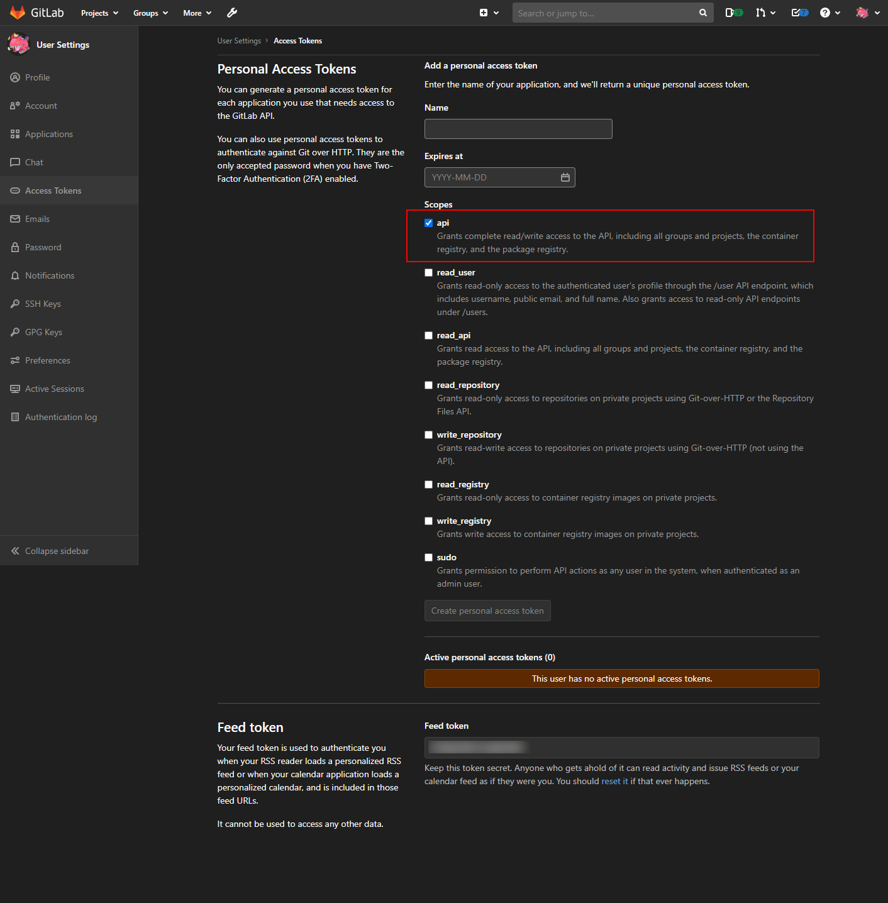

# Clean up pipeline history

## Abstracts

* Clean up all pipeline history from all projects

## How to start?

### Create Access Token

Go to `User Settings` and `Access Tokens`.
Set `Name` and `Expires at`.



### Do clean up!!

````cmd
$ pwsh -GitLabHost <gitlab host> -Token <access token>
````

For example,

````cmd
$ pwsh -GitLabHost https://www.contoso.com/gitlab -Token hD7W3hkUGbRJT9hZYZtN

Total Projects: 169
Total Pipelines: 0 in Project '67'
Total Pipelines: 0 in Project '66'
Total Pipelines: 0 in Project '65'
Total Pipelines: 1 in Project '37'
Success to delete '3' in Project '37'
Total Pipelines: 0 in Project '36'
Total Pipelines: 0 in Project '35'
Total Pipelines: 0 in Project '34'
Total Pipelines: 0 in Project '33'
Total Pipelines: 1 in Project '32'
Success to delete '2' in Project '32'
Total Pipelines: 1 in Project '31'
Success to delete '1' in Project '31'
Total Pipelines: 0 in Project '24'
Total Pipelines: 0 in Project '23'
Total Pipelines: 0 in Project '22'
Total Pipelines: 0 in Project '20'
Total Pipelines: 0 in Project '19'
Total Pipelines: 0 in Project '18'
Total Pipelines: 0 in Project '10'
Total Pipelines: 0 in Project '9'
Total Pipelines: 0 in Project '5'
Total Pipelines: 0 in Project '4'
````