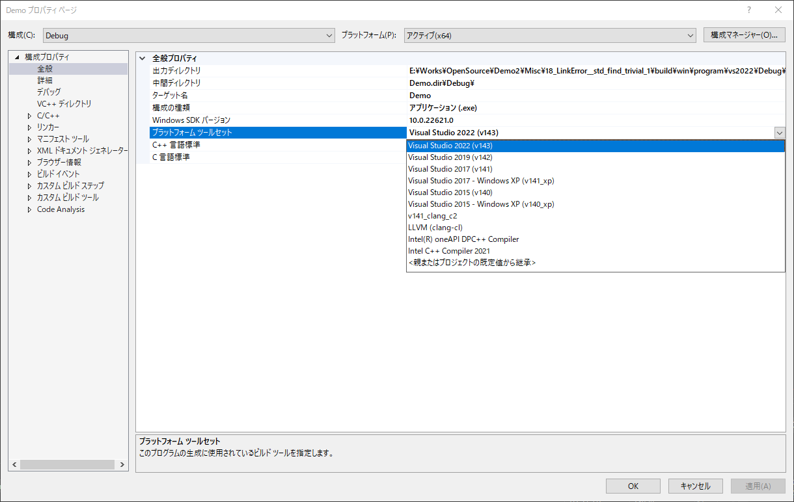
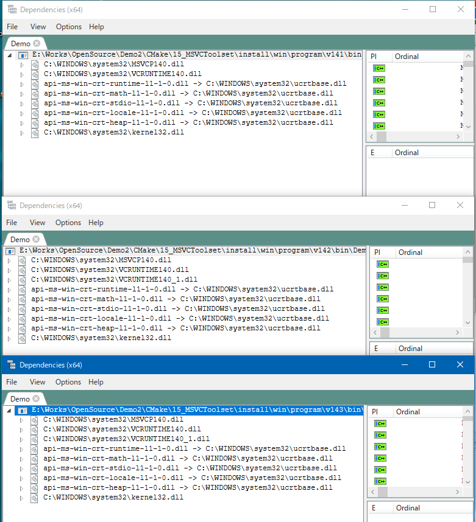

# Specify Toolset version

## Abstracts

* How to specify platform toolset version by command line



## Requirements

### Windows

* Visual Studio
* CMake 3.0 or later

## How to specify?

See [Visual Studio 15 2017](https://cmake.org/cmake/help/v3.8/generator/Visual%20Studio%2015%202017.html).
We can specify toolset version by using `-T` option.
And `T` option can specify hosts architecture (it depends on target architecture).
For examples,

````cmd
cmake -G "Visual Studio 17 2022" -A x64 -T v142,host=x64 `
      ..
````

This command generates `*.vcxproj`.
This file contains `PlatformToolset` section and this section will be replace with `v142`.

Definitely, generated binary links different runtimes.

