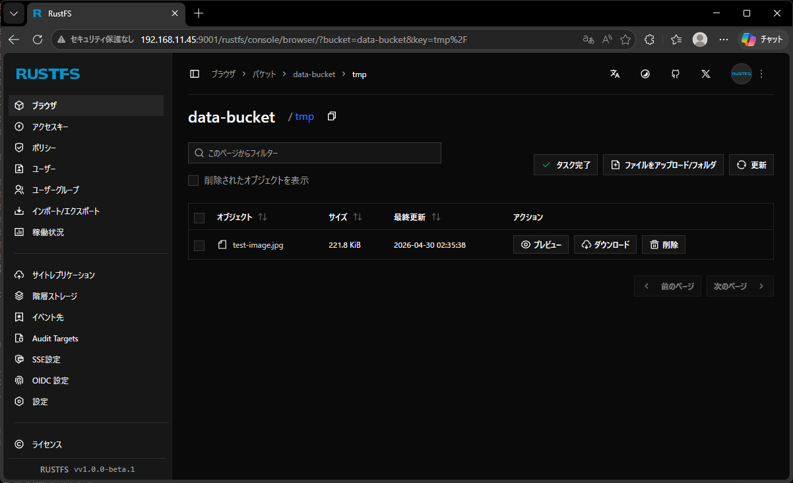

# Put object

## Abstracts

* Upload file to specified backet

## Requirements

### Common

* Powershell
* CMake 3.15.0 or later
* C++ Compiler supports C++11

### Windows

* Visual Studio

### Ubuntu

* g++

### OSX

* Xcode

## Dependencies

* [AWS SDK for C++](https://github.com/aws/aws-sdk-cpp)
  * 1.11.798
  * Apache 2.0 License

## How to build?

### Build AWS SDK for C++

Go to [AmazonWebService-Compatibility](../../..).

````shell
$ pwsh build.ps1 <Debug/Release>
````

Once time you built AWS SDK for C++, you need not to do again.

### Build

````shell
$ pwsh build.ps1 <Debug/Release>
````

Then, program will be present in `install/<your os name>/bin`.

## How to use?



### Windows

````bat
$ set AWS_ACCESS_KEY_ID=rustfsadmin
$ set AWS_SECRET_ACCESS_KEY=rustfsadmin
$ .\install\win\Release\bin\Demo.exe http://192.168.11.45:9000 data-bucket /tmp/test-image.jpg ap-northeast-1
[Info]    endpoint: http://192.168.11.45:9000
[Info] bucket_name: data-bucket
[Info] object_name: /tmp/test-image.jpg
[Info]      region: ap-northeast-1
[Info]    filepath: lenna.jpg
[Info] Aws::InitAPI
[Info] Use access key and secret key
[Info] Succeded to upload file
[Info] Aws::ShutdownAPI
````

### Linux

````bash
$ export AWS_ACCESS_KEY_ID=rustfsadmin
$ export AWS_SECRET_ACCESS_KEY=rustfsadmin
$ ./install/linux/Release/bin/Demo http://192.168.11.45:9000 data-bucket /tmp/test-image.jpg ap-northeast-1 lenna.jpg
[Info]    endpoint: http://192.168.11.45:9000
[Info] bucket_name: data-bucket
[Info] object_name: /tmp/test-image.jpg
[Info]      region: ap-northeast-1
[Info]    filepath: lenna.jpg
[Info] Aws::InitAPI
[Info] Use access key and secret key
[Info] Succeded to upload file
[Info] Aws::ShutdownAPI
````

### OSX

````bash
$ export AWS_ACCESS_KEY_ID=rustfsadmin
$ export AWS_SECRET_ACCESS_KEY=rustfsadmin
$ ./install/osx/Release/bin/Demo http://192.168.11.45:9000 data-bucket /tmp/test-image.jpg ap-northeast-1 lenna.jpg
[Info]    endpoint: http://192.168.11.45:9000
[Info] bucket_name: data-bucket
[Info] object_name: /tmp/test-image.jpg
[Info]      region: ap-northeast-1
[Info]    filepath: lenna.jpg
[Info] Aws::InitAPI
[Info] Use access key and secret key
[Info] Succeded to upload file
[Info] Aws::ShutdownAPI
````