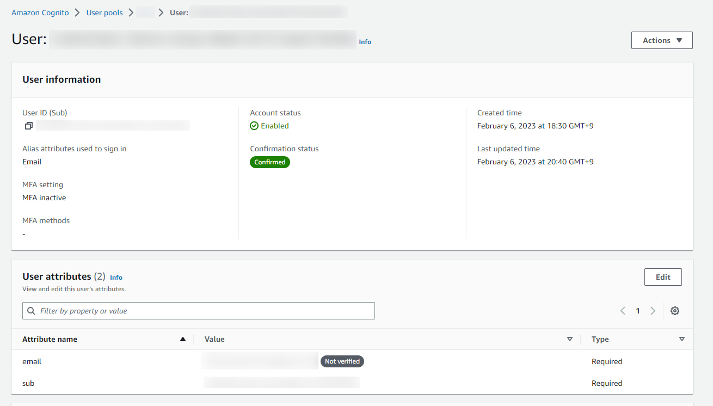
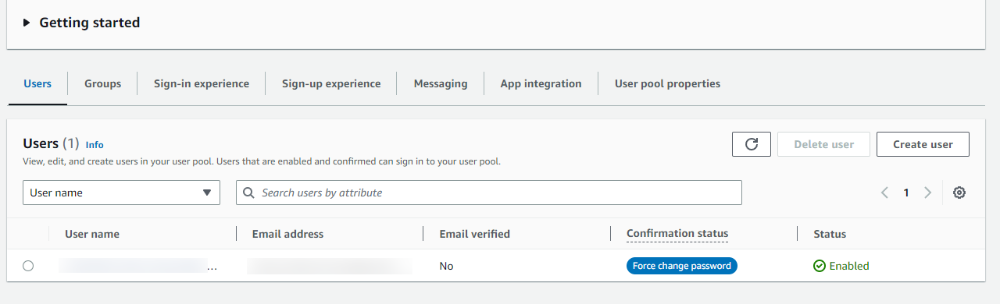

# User pool authentication with ALLOW_USER_PASSWORD_AUTH

## Abstracts

* Authentication for user pool with ALLOW_USER_PASSWORD_AUTH
  * password base authentication

## Requirements

### Common

* Powershell
* CMake 3.0.0 or later
* C++ Compiler supports C++11

### Windows

* Visual Studio
* cpprestsdk
  * via `vcpkg` command with `--triplet x64-windows-static`

### Ubuntu

* g++
* libcpprest-dev
  * via `apt` command
* libssl

### OSX

* Xcode
* cpprestsdk
  * via `brew` command

## Dependencies

* [cpprestsdk](https://github.com/microsoft/cpprestsdk)
  * 2.10.18
  * MIT License

## How to build?

You have to set `VCPKG_ROOT_DIR` envrironmental variable, like `C:\vcpkg` before build cpprestsdk on windows machine.

````shell
$ pwsh build.ps1  <Debug/Release>
````

## How to use?

At first, you must create

* User pool
* User into created user pool
* App clients into created user pool



Then, you can get token.

````shell
$ ./install/<os name>/bin/Test "<region>" \
                               "<app_client_id>" \
                               "<your_username>" \
                               "<your_password>"
{
  "AuthenticationResult": {
    "AccessToken": "...",
    "ExpiresIn": 3600,
    "IdToken": "...",
    "RefreshToken": "...",
    "TokenType": "Bearer"
  },
  "ChallengeParameters": {}
}
AuthenticationResult.IdToken: "..."
````

If program return json like ,

````json
{
	"ChallengeName": "NEW_PASSWORD_REQUIRED",
	"ChallengeParameters": {
		"USER_ID_FOR_SRP": "32C4C762-4573-4CE0-AB03-C14E3E07ADB0",
		"requiredAttributes": "[]",
		"userAttributes": "{\"email\":\"<your_email>\"}"
	},
	"Session": "..."
}
````

Cognito requests you to change password.



So you can change password by using AWS CLI.

````shell
aws cognito-idp admin-respond-to-auth-challenge \
--user-pool-id <user_pool_id> \
--client-id <app_client_id>> \
--challenge-name NEW_PASSWORD_REQUIRED \
--challenge-responses NEW_PASSWORD='<your_new_password>',USERNAME='<your_email>' \
--session "<session>"
````

Before invoke this command, you must assign proper action to current user.

````sh
An error occurred (AccessDeniedException) when calling the AdminRespondToAuthChallenge operation: User: arn:aws:iam::999999999999:user/userA is not authorized to perform: cognito-idp:AdminRespondToAuthChallenge on resource: arn:aws:cognito-idp:ap-northeast-1:999999999999:userpool/ap-northeast-1 because no identity-based policy allows the cognito-idp:AdminRespondToAuthChallenge action
````
