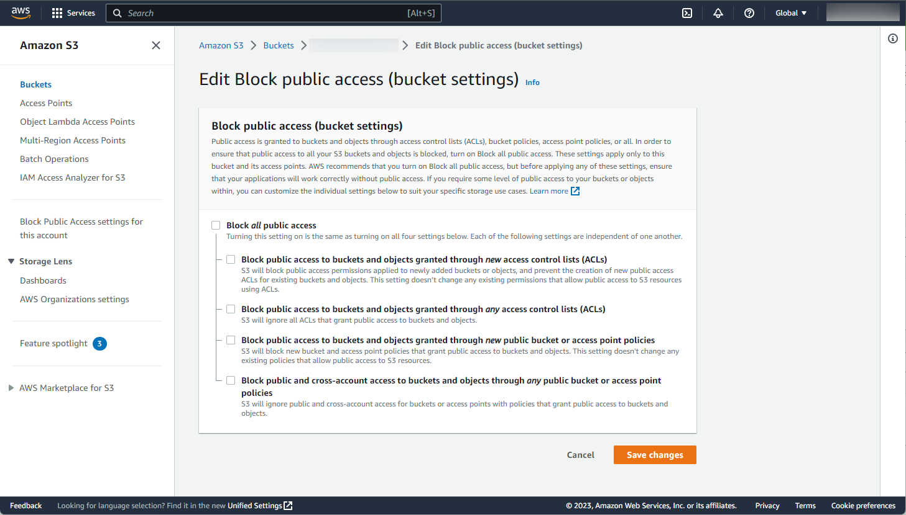

# Get File from S3

## Abstracts

* Download file from S3

## Requirements

### Common

* Powershell
* CMake 3.15.0 or later
* C++ Compiler supports C++11

### Windows

* Visual Studio

### Ubuntu

* g++

### OSX

* Xcode

## Dependencies

* [AWS SDK for C++](https://github.com/aws/aws-sdk-cpp)
  * 1.11.798
  * Apache 2.0 License

## How to build?

### Build AWS SDK for C++

Go to [AmazonWebService](../../../..).

````shell
$ pwsh build.ps1 <Debug/Release>
````

Once time you built AWS SDK for C++, you need not to do again.

### Build

````shell
$ pwsh build.ps1 <Debug/Release>
````

Then, program will be present in `install/<your os name>/bin`.

## How to use?

### Windows

````bat
$ set AWS_ACCESS_KEY_ID=xxxxxxxx
$ set AWS_SECRET_ACCESS_KEY=yyyyyyyy
$ .\install\win\Release\bin\Demo.exe http://192.168.11.45:9000 data-bucket /tmp/test-image.jpg ap-northeast-1
[Info]    endpoint: http://192.168.11.45:9000
[Info] bucket_name: data-bucket
[Info] object_name: /tmp/test-image.jpg
[Info]      region: ap-northeast-1
[Info]    filepath: lenna.jpg
[Info] Aws::InitAPI
[Info] Use access key and secret key
[Info] Succeded to upload file
[Info] Aws::ShutdownAPI
````

### Linux

````bash
$ export AWS_ACCESS_KEY_ID=xxxxxxxx
$ export AWS_SECRET_ACCESS_KEY=yyyyyyyy
$ ./install/linux/Release/bin/Demo ve8rjmzuy84wq7f2iyhp lenna.jpg ap-northeast-1
bucket_name: ve8rjmzuy84wq7f2iyhp
object_name: lenna.jpg
     region: ap-northeast-1
[Info] Aws::InitAPI
[Info] GetObject
[Info] Retrieved object 'lenna.jpg' from bucket 've8rjmzuy84wq7f2iyhp'.
[Info] Aws::ShutdownAPI
````

### OSX

````bash
$ export AWS_ACCESS_KEY_ID=xxxxxxxx
$ export AWS_SECRET_ACCESS_KEY=yyyyyyyy
$ ./install/osx/Release/bin/Demo http://192.168.11.45:9000 data-bucket /tmp/test-image.jpg ap-northeast-1 lenna.jpg
[Info]    endpoint: http://192.168.11.45:9000
[Info] bucket_name: data-bucket
[Info] object_name: /tmp/test-image.jpg
[Info]      region: ap-northeast-1
[Info]    filepath: lenna.jpg
[Info] Aws::InitAPI
[Info] Use access key and secret key
[Info] Succeded to upload file
[Info] Aws::ShutdownAPI
````

## Why does program not work?

### Error: GetObject: Access Denied

You must check the following things

#### Block public access (bucket setting)

This program does not take care of credentials. In other words, we have to disable block public access in AWS console.



#### Block policy

Bcket policy must allow write actions.
For examples, you can write json like 

````json
{
    "Version": "2012-10-17",
    "Id": "Policy9999999999999",
    "Statement": [
        {
            "Sid": "Stmt9999999999999",
            "Effect": "Allow",
            "Principal": "*",
            "Action": [
                "s3:DeleteObject",
                "s3:GetObject",
                "s3:PutObject"
            ],
            "Resource": "arn:aws:s3:::<your-bucket-name>/*"
        }
    ]
}
````
