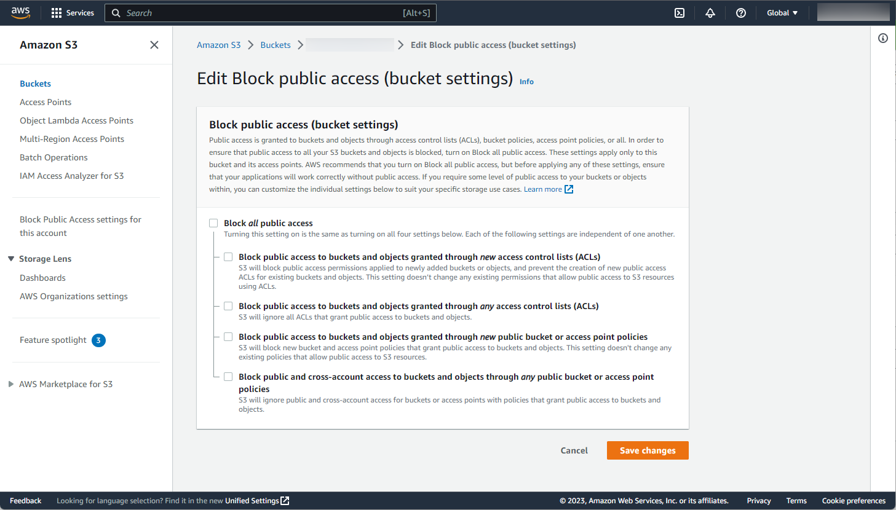

# Upload File to S3

## Abstracts

* Upload file to S3
  * This program assumes that S3 bucket allow public access.

## Requirements

### Common

* Powershell
* CMake 3.0.0 or later
* C++ Compiler supports C++11

### Windows

* Visual Studio

### Ubuntu

* g++

### OSX

* Xcode

## Dependencies

* [AWS SDK for C++](https://github.com/aws/aws-sdk-cpp)
  * 1.11.4
  * Apache 2.0 License

## How to build?

### Build AWS SDK for C++

Go to [aws-sdk-cpp](../aws-sdk-cpp).

````shell
$ pwsh build.ps1 <Debug/Release>
````

Once time you built AWS SDK for C++, you need not to do again.

### Build

````shell
$ pwsh build.ps1 <Debug/Release>
````

Then, program will be present in `install/<your os name>/bin`.

## How to test?

````shell
$ ./install/linux/bin/Test <your-bucket-name> lenna.jpg <your-region>
bucket_name: <your-bucket-name>
object_name: lenna.jpg
     region: <your-region>
[Info] Aws::InitAPI
[Info] PutObject
Added object 'lenna.jpg' to bucket '<your-bucket-name>'.
[Info] Aws::ShutdownAPI
````

## Why does program not work?

### Error: PutObject: Access Denied

You must check the following things

#### Block public access (bucket setting)

This program does not take care of credentials. In other words, we have to disable block public access in AWS console.



#### Block policy

Bcket policy must allow write actions.
For examples, you can write json like 

````json
{
    "Version": "2012-10-17",
    "Id": "Policy9999999999999",
    "Statement": [
        {
            "Sid": "Stmt9999999999999",
            "Effect": "Allow",
            "Principal": "*",
            "Action": [
                "s3:DeleteObject",
                "s3:GetObject",
                "s3:PutObject"
            ],
            "Resource": "arn:aws:s3:::<your-bucket-name>/*"
        }
    ]
}
````
