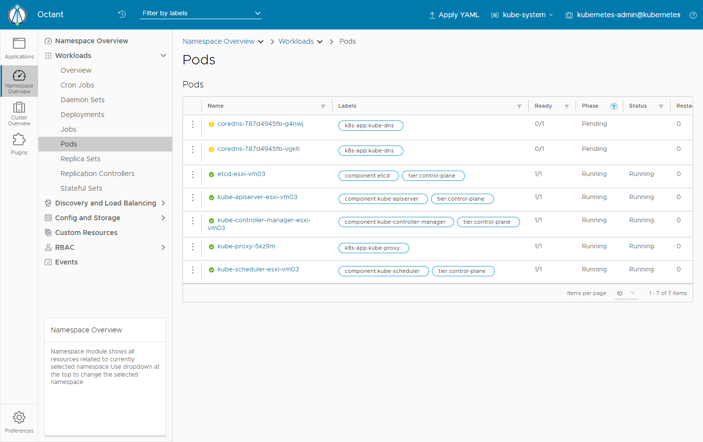

# Octant

## Abstracts

* Visualize kubernetes cluster

## Dependencies

* [Octant](https://github.com/vmware-archive/octant)
  * 0.25.1
  * Apache-2.0 license

## How to install?

### Debian

````sh
$ wget https://github.com/vmware-archive/octant/releases/download/v0.25.1/octant_0.25.1_Linux-64bit.deb -O octant_0.25.1_Linux-64bit.deb
$ sudo apt install ./octant_0.25.1_Linux-64bit.deb
````

## How to use?

You can only kick octant.

````sh
$ octant
````



But default behavior of Octant does not allow to be exposed to outer user.
So Octant looks like to be able to control hosts to access.

For examples,

````sh
$ OCTAT_ACCEPTED_HOSTS=192.16.11.* KUBECONFIG=~/.kube/config OCTANT_LISTENER_ADDR=0.0.0.0:8900 octant
````

But `OCTAT_ACCEPTED_HOSTS` does not work for me.
This issue is raised on [No content displayed when setting OCTANT_LISTENER_ADDR=0.0.0.0:7777](https://github.com/vmware-archive/octant/issues/237#issuecomment-527700042) but Octant is no longer maintained.

### As a service

For example, you can install Octant as service on systemd.

````sh
$ sudo tee /usr/lib/systemd/system/octant.service <<-'EOF'
[Unit]
Description=octant

[Service]
Environment="HOME=/home/user-X"
Environment="OCTANT_ACCEPTED_HOSTS=192.168.11.21"
Environment="KUBECONFIG=/home/user-X/.kube/config"
Environment="OCTANT_LISTENER_ADDR=0.0.0.0:8900"
Environment="OCTANT_DISABLE_OPEN_BROWSER=true"
Environment="PATH=/bin:/usr/local/sbin:/usr/local/bin:/usr/sbin:/usr/bin"
WorkingDirectory=/usr/local/bin/
ExecStart=/usr/local/bin/octant
Type=simple
Restart=on-failure

[Install]
WantedBy=multi-user.target

EOF
$ sudo chmod 755 -R /usr/lib/systemd/system/octant.service
````

After that, you can start service.

````sh
$ sudo systemctl enable octant
$ sudo systemctl start octant
$ sudo systemctl status octant
● octant.service - octant
     Loaded: loaded (/lib/systemd/system/octant.service; disabled; vendor preset: enabled)
     Active: active (running) since Thu 2023-03-02 00:03:52 JST; 16s ago
   Main PID: 24813 (octant)
      Tasks: 11 (limit: 28757)
     Memory: 12.4M
     CGroup: /system.slice/octant.service
             └─24813 /usr/local/bin/octant

 3月 02 00:03:52 esxi-vm03 octant[24813]: 2023-03-02T00:03:52.069+0900        INFO        module/manager.go:87        registering action        {"component": "module-manager", "a>
 3月 02 00:03:52 esxi-vm03 octant[24813]: 2023-03-02T00:03:52.069+0900        INFO        module/manager.go:87        registering action        {"component": "module-manager", "a>
 3月 02 00:03:52 esxi-vm03 octant[24813]: 2023-03-02T00:03:52.069+0900        INFO        module/manager.go:87        registering action        {"component": "module-manager", "a>
 3月 02 00:03:52 esxi-vm03 octant[24813]: 2023-03-02T00:03:52.069+0900        INFO        module/manager.go:87        registering action        {"component": "module-manager", "a>
 3月 02 00:03:52 esxi-vm03 octant[24813]: 2023-03-02T00:03:52.069+0900        INFO        module/manager.go:87        registering action        {"component": "module-manager", "a>
 3月 02 00:03:52 esxi-vm03 octant[24813]: 2023-03-02T00:03:52.069+0900        INFO        module/manager.go:87        registering action        {"component": "module-manager", "a>
 3月 02 00:03:52 esxi-vm03 octant[24813]: 2023-03-02T00:03:52.070+0900        WARN        plugin/manager.go:405        Unable to add /home/user-X/.config/octant/plugins to th>
 3月 02 00:03:52 esxi-vm03 octant[24813]: github.com/vmware-tanzu/octant/pkg/plugin.(*Manager).watchPluginFiles
 3月 02 00:03:52 esxi-vm03 octant[24813]:         /__w/octant/octant/pkg/plugin/manager.go:405
 3月 02 00:03:52 esxi-vm03 octant[24813]: 2023-03-02T00:03:52.084+0900        INFO        dash/dash.go:546        Dashboard is available at http://[::]:8900
````