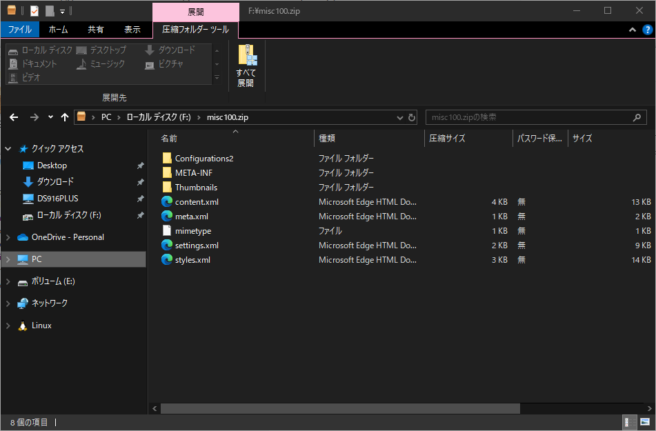

# Q19.[Misc]Image!

## How to resolve?

At first, you should open [misc100.zip](./misc100.zip) by application to unzip.
Then you will see the following contents.

It looks like other file format.
And you can find `application/vnd.oasis.opendocument.graphics` in mimetype.

In other words?