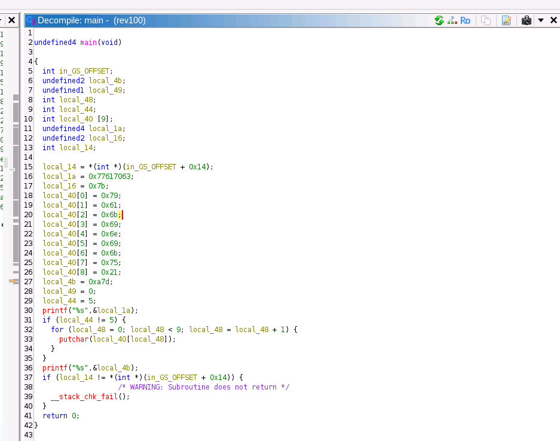

# Q21.[Reversing]reversing easy!

## How to resolve?

````bash
$ file rev100 
rev100: ELF 32-bit LSB executable, Intel 80386, version 1 (SYSV), dynamically linked, interpreter /lib/ld-linux.so.2, for GNU/Linux 2.6.24, BuildID[sha1]=f94360edd84a940de2b74007d4289705601d618d, not stripped
````

Watch your step.
This module is 32bit binary and you can not run it on x86_&4 machine.
So you must install `lib32stdc++6` and `lib32z1`.
Otherwise, you will see `bash: ./rev100: No such file or directory` message.

But you can see the following message in spite of installing the above pacakges.

````bash
$ ./rev100
cpaw{}
````

Therefore, you need to disassemble [rev100](./rev100).
For example, [Ghidra](https://ghidra-sre.org/).



In other words?