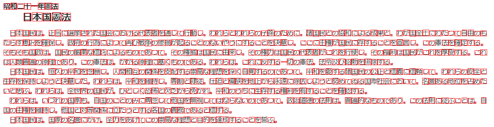

# OCR on Windows 10 (for .NET)

## Abstacts

* How to use OCR engine embeded on Windows 10
  * Recognize characters
  * Detect Text Positions
* Check how much influence is accuracy with or without Language Pack

## Requirements

* .NET 6.0
* Windows 10
  * 19041 or later
* Language Pack
  * e.g. Install english language if you want to recognize english text

## Dependencies

* [NLog](https://github.com/NLog/NLog)
  * BSD-3-Clause license
* [SkiaSharp](https://github.com/mono/SkiaSharp)
  * MIT license

## How to usage?

````cmd
$ sources\Demo
$ dotnet run -c Release -- ja ..\..\testdata\ja.png
2022-06-11 23:05:03.4742 [INFO ] TrySetupOcrEngine: 23 ms
2022-06-11 23:05:03.5066 [INFO ] GetImageBinary: 0 ms
2022-06-11 23:05:03.5604 [INFO ] ConvertToSoftwareBitmap: 51 ms
2022-06-11 23:05:03.6613 [INFO ] Angle: -0
2022-06-11 23:05:03.6801 [INFO ] 昭 和 ニ 十 - 年 憲 法
2022-06-11 23:05:03.6801 [INFO ]        昭      9       8       24      23
2022-06-11 23:05:03.6801 [INFO ]        和      26      7       41      23
2022-06-11 23:05:03.6801 [INFO ]        ニ      43      9       59      22
2022-06-11 23:05:03.6801 [INFO ]        十      60      8       76      23
2022-06-11 23:05:03.6801 [INFO ]        -       77      13      93      15
2022-06-11 23:05:03.6801 [INFO ]        年      94      7       110     23
2022-06-11 23:05:03.6801 [INFO ]        憲      111     7       127     23
2022-06-11 23:05:03.6801 [INFO ]        法      128     8       144     23
2022-06-11 23:05:03.6801 [INFO ] 日 本 国 憲 法
2022-06-11 23:05:03.6801 [INFO ]        日      59      32      77      52
2022-06-11 23:05:03.6801 [INFO ]        本      80      31      104     52
2022-06-11 23:05:03.6892 [INFO ]        国      106     32      126     52
2022-06-11 23:05:03.6892 [INFO ]        憲      129     31      151     52
2022-06-11 23:05:03.6892 [INFO ]        法      153     32      175     52
2022-06-11 23:05:03.6892 [INFO ] 日 本 国 民 は 、 正 当 に 選 挙 さ れ た 国 会 に お け る 代 表 者 を 通 し て 行 動 し 、 わ れ ら と わ れ ら の 子 孫 の た め に 、 諸 国 民 と の 協 和 に よ る 成 果 と 、 わ が 国 全 土 に わ た っ て 自 由 の も
2022-06-11 23:05:03.6892 [INFO ]        日      26      75      38      90
2022-06-11 23:05:03.6892 [INFO ]        本      40      74      56      89
2022-06-11 23:05:03.6892 [INFO ]        国      57      75      71      90
2022-06-11 23:05:03.6892 [INFO ]        民      73      75      88      89
2022-06-11 23:05:03.6892 [INFO ]        は      89      76      104     89
2022-06-11 23:05:03.6892 [INFO ]        、      105     85      109     89
2022-06-11 23:05:03.6892 [INFO ]        正      121     75      135     89
2022-06-11 23:05:03.6892 [INFO ]        当      137     74      151     90
2022-06-11 23:05:03.6892 [INFO ]        に      154     76      167     89
2022-06-11 23:05:03.6892 [INFO ]        選      168     75      184     89
2022-06-11 23:05:03.6892 [INFO ]        挙      184     75      200     89
2022-06-11 23:05:03.6892 [INFO ]        さ      201     75      215     89
2022-06-11 23:05:03.6892 [INFO ]        れ      216     75      232     89
2022-06-11 23:05:03.6892 [INFO ]        た      233     75      247     88
2022-06-11 23:05:03.6892 [INFO ]        国      249     75      263     90
2022-06-11 23:05:03.6892 [INFO ]        会      264     75      280     89
2022-06-11 23:05:03.6892 [INFO ]        に      282     76      295     89
2022-06-11 23:05:03.6892 [INFO ]        お      297     75      312     88
2022-06-11 23:05:03.6892 [INFO ]        け      314     76      328     89
2022-06-11 23:05:03.6892 [INFO ]        る      329     76      342     89
2022-06-11 23:05:03.6892 [INFO ]        代      344     75      359     89
2022-06-11 23:05:03.6892 [INFO ]        表      360     74      376     89
2022-06-11 23:05:03.6892 [INFO ]        者      377     74      392     89
2022-06-11 23:05:03.6892 [INFO ]        を      393     75      407     89
2022-06-11 23:05:03.6892 [INFO ]        通      408     75      424     89
2022-06-11 23:05:03.6892 [INFO ]        し      427     75      439     88
2022-06-11 23:05:03.6892 [INFO ]        て      441     77      455     89
2022-06-11 23:05:03.6892 [INFO ]        行      456     74      472     89
2022-06-11 23:05:03.6892 [INFO ]        動      473     74      487     89
2022-06-11 23:05:03.6892 [INFO ]        し      491     76      503     88
2022-06-11 23:05:03.6892 [INFO ]        、      505     85      509     89
2022-06-11 23:05:03.6892 [INFO ]        わ      520     75      535     89
2022-06-11 23:05:03.7045 [INFO ]        れ      536     75      552     89
2022-06-11 23:05:03.7045 [INFO ]        ら      554     75      567     89
2022-06-11 23:05:03.7045 [INFO ]        と      570     75      583     88
2022-06-11 23:05:03.7045 [INFO ]        わ      584     75      599     89
2022-06-11 23:05:03.7045 [INFO ]        れ      600     75      616     89
2022-06-11 23:05:03.7045 [INFO ]        ら      618     75      631     89
2022-06-11 23:05:03.7045 [INFO ]        の      633     77      648     89
2022-06-11 23:05:03.7045 [INFO ]        子      649     76      663     89
2022-06-11 23:05:03.7045 [INFO ]        孫      664     74      680     89
2022-06-11 23:05:03.7045 [INFO ]        の      681     77      696     89
2022-06-11 23:05:03.7045 [INFO ]        た      697     75      711     88
2022-06-11 23:05:03.7045 [INFO ]        め      712     76      727     89
2022-06-11 23:05:03.7045 [INFO ]        に      730     76      743     89
2022-06-11 23:05:03.7045 [INFO ]        、      745     85      749     89
2022-06-11 23:05:03.7045 [INFO ]        諸      760     74      776     89
2022-06-11 23:05:03.7045 [INFO ]        国      777     75      791     90
2022-06-11 23:05:03.7045 [INFO ]        民      793     75      808     89
2022-06-11 23:05:03.7045 [INFO ]        と      810     75      823     88
2022-06-11 23:05:03.7045 [INFO ]        の      825     77      840     89
2022-06-11 23:05:03.7045 [INFO ]        協      840     74      855     89
2022-06-11 23:05:03.7045 [INFO ]        和      856     74      871     89
2022-06-11 23:05:03.7045 [INFO ]        に      874     76      887     89
2022-06-11 23:05:03.7045 [INFO ]        よ      889     75      903     89
2022-06-11 23:05:03.7045 [INFO ]        る      905     76      918     89
2022-06-11 23:05:03.7045 [INFO ]        成      920     74      935     89
2022-06-11 23:05:03.7045 [INFO ]        果      936     75      952     89
2022-06-11 23:05:03.7045 [INFO ]        と      954     75      967     88
2022-06-11 23:05:03.7045 [INFO ]        、      969     85      973     89
2022-06-11 23:05:03.7045 [INFO ]        わ      984     75      999     89
2022-06-11 23:05:03.7045 [INFO ]        が      1001    74      1016    88
2022-06-11 23:05:03.7045 [INFO ]        国      1017    75      1031    90
2022-06-11 23:05:03.7045 [INFO ]        全      1032    75      1048    89
2022-06-11 23:05:03.7045 [INFO ]        土      1049    74      1064    89
2022-06-11 23:05:03.7045 [INFO ]        に      1066    76      1079    89
2022-06-11 23:05:03.7045 [INFO ]        わ      1080    75      1095    89
2022-06-11 23:05:03.7045 [INFO ]        た      1097    75      1111    88
2022-06-11 23:05:03.7196 [INFO ]        っ      1113    77      1127    88
2022-06-11 23:05:03.7196 [INFO ]        て      1129    77      1143    89
2022-06-11 23:05:03.7196 [INFO ]        自      1146    74      1158    89
2022-06-11 23:05:03.7196 [INFO ]        由      1161    74      1175    89
2022-06-11 23:05:03.7196 [INFO ]        の      1177    77      1192    89
2022-06-11 23:05:03.7196 [INFO ]        も      1193    76      1207    89
2022-06-11 23:05:03.7196 [INFO ] た ら す 恵 沢 を 確 保 し 、 政 府 の 行 為 に よ っ て 再 び 戦 争 の 惨 禍 が 起 る こ と の な い や う に す る こ と を 決 意 し 、 こ こ に 主 権 が 国 民 に 存 す る こ と を 目 言 し 、 こ の 法 を 確 定 す る 。
2022-06-11 23:05:03.7196 [INFO ]        た      9       99      23      112
2022-06-11 23:05:03.7196 [INFO ]        ら      26      99      39      113
2022-06-11 23:05:03.7196 [INFO ]        す      41      99      56      113
2022-06-11 23:05:03.7196 [INFO ]        恵      57      98      72      113
2022-06-11 23:05:03.7196 [INFO ]        沢      73      99      88      113
2022-06-11 23:05:03.7196 [INFO ]        を      89      99      103     113
2022-06-11 23:05:03.7196 [INFO ]        確      104     98      121     114
2022-06-11 23:05:03.7196 [INFO ]        保      121     99      136     113
2022-06-11 23:05:03.7196 [INFO ]        し      139     100     151     112
2022-06-11 23:05:03.7196 [INFO ]        、      153     109     157     113
2022-06-11 23:05:03.7196 [INFO ]        政      168     98      183     113
2022-06-11 23:05:03.7196 [INFO ]        府      184     98      199     113
2022-06-11 23:05:03.7196 [INFO ]        の      201     101     215     113
2022-06-11 23:05:03.7196 [INFO ]        行      216     98      232     113
2022-06-11 23:05:03.7196 [INFO ]        為      232     98      247     113
2022-06-11 23:05:03.7196 [INFO ]        に      250     100     263     113
2022-06-11 23:05:03.7196 [INFO ]        よ      265     99      279     113
2022-06-11 23:05:03.7196 [INFO ]        っ      281     101     295     112
2022-06-11 23:05:03.7196 [INFO ]        て      297     101     311     113
2022-06-11 23:05:03.7196 [INFO ]        再      312     99      328     113
2022-06-11 23:05:03.7196 [INFO ]        び      329     98      344     113
2022-06-11 23:05:03.7196 [INFO ]        戦      344     98      360     113
2022-06-11 23:05:03.7196 [INFO ]        争      360     98      376     114
2022-06-11 23:05:03.7196 [INFO ]        の      377     101     392     113
2022-06-11 23:05:03.7196 [INFO ]        惨      392     99      409     113
2022-06-11 23:05:03.7196 [INFO ]        禍      409     99      424     113
2022-06-11 23:05:03.7196 [INFO ]        が      425     98      440     112
2022-06-11 23:05:03.7196 [INFO ]        起      440     98      456     113
2022-06-11 23:05:03.7196 [INFO ]        る      457     100     470     113
2022-06-11 23:05:03.7196 [INFO ]        こ      474     101     487     112
2022-06-11 23:05:03.7355 [INFO ]        と      490     99      503     112
2022-06-11 23:05:03.7355 [INFO ]        の      505     101     520     113
2022-06-11 23:05:03.7355 [INFO ]        な      521     99      535     113
2022-06-11 23:05:03.7355 [INFO ]        い      537     101     551     112
2022-06-11 23:05:03.7355 [INFO ]        や      552     99      567     113
2022-06-11 23:05:03.7355 [INFO ]        う      570     100     582     113
2022-06-11 23:05:03.7355 [INFO ]        に      586     100     599     113
2022-06-11 23:05:03.7355 [INFO ]        す      601     99      616     113
2022-06-11 23:05:03.7355 [INFO ]        る      617     100     630     113
2022-06-11 23:05:03.7355 [INFO ]        こ      634     101     647     112
2022-06-11 23:05:03.7355 [INFO ]        と      650     99      663     112
2022-06-11 23:05:03.7355 [INFO ]        を      665     99      679     113
2022-06-11 23:05:03.7355 [INFO ]        決      680     98      696     113
2022-06-11 23:05:03.7355 [INFO ]        意      697     98      712     113
2022-06-11 23:05:03.7355 [INFO ]        し      715     100     727     112
2022-06-11 23:05:03.7355 [INFO ]        、      729     109     733     113
2022-06-11 23:05:03.7355 [INFO ]        こ      746     101     759     112
2022-06-11 23:05:03.7355 [INFO ]        こ      762     101     775     112
2022-06-11 23:05:03.7355 [INFO ]        に      778     100     791     113
2022-06-11 23:05:03.7355 [INFO ]        主      793     98      807     113
2022-06-11 23:05:03.7355 [INFO ]        権      808     98      824     114
2022-06-11 23:05:03.7355 [INFO ]        が      825     98      840     112
2022-06-11 23:05:03.7355 [INFO ]        国      841     99      855     114
2022-06-11 23:05:03.7355 [INFO ]        民      857     99      872     113
2022-06-11 23:05:03.7355 [INFO ]        に      874     100     887     113
2022-06-11 23:05:03.7355 [INFO ]        存      888     98      904     113
2022-06-11 23:05:03.7355 [INFO ]        す      905     99      920     113
2022-06-11 23:05:03.7355 [INFO ]        る      921     100     934     113
2022-06-11 23:05:03.7355 [INFO ]        こ      938     101     951     112
2022-06-11 23:05:03.7355 [INFO ]        と      954     99      967     112
2022-06-11 23:05:03.7355 [INFO ]        を      969     99      983     113
2022-06-11 23:05:03.7516 [INFO ]        目      985     98      999     113
2022-06-11 23:05:03.7516 [INFO ]        言      1001    99      1015    113
2022-06-11 23:05:03.7516 [INFO ]        し      1019    100     1031    112
2022-06-11 23:05:03.7516 [INFO ]        、      1033    109     1037    113
2022-06-11 23:05:03.7516 [INFO ]        こ      1050    101     1063    112
2022-06-11 23:05:03.7516 [INFO ]        の      1065    101     1080    113
2022-06-11 23:05:03.7516 [INFO ]        法      1097    99      1112    113
2022-06-11 23:05:03.7516 [INFO ]        を      1113    99      1127    113
2022-06-11 23:05:03.7516 [INFO ]        確      1128    98      1144    114
2022-06-11 23:05:03.7516 [INFO ]        定      1145    98      1159    113
2022-06-11 23:05:03.7516 [INFO ]        す      1161    99      1176    113
2022-06-11 23:05:03.7516 [INFO ]        る      1177    100     1190    113
2022-06-11 23:05:03.7516 [INFO ]        。      1193    109     1198    113
2022-06-11 23:05:03.7516 [INFO ] そ も そ も 国 政 は 、 国 民 の 廠 粛 な 信 託 に よ る も の で あ っ て 、 そ の 権 威 は 国 民 に 由 来 し 、 そ の 権 力 は 国 民 の 代 表 者 が こ れ を 行 使 し 、 そ の 福 利 は 国 民 が こ れ を 享 受 す る 。 こ れ
2022-06-11 23:05:03.7516 [INFO ]        そ      9       124     23      137
2022-06-11 23:05:03.7516 [INFO ]        も      25      124     39      137
2022-06-11 23:05:03.7516 [INFO ]        そ      41      124     55      137
2022-06-11 23:05:03.7516 [INFO ]        も      57      124     71      137
2022-06-11 23:05:03.7516 [INFO ]        国      73      123     87      138
2022-06-11 23:05:03.7516 [INFO ]        政      88      122     104     137
2022-06-11 23:05:03.7516 [INFO ]        は      106     124     120     137
2022-06-11 23:05:03.7516 [INFO ]        、      121     133     125     137
2022-06-11 23:05:03.7516 [INFO ]        国      137     123     151     138
2022-06-11 23:05:03.7516 [INFO ]        民      153     123     168     137
2022-06-11 23:05:03.7516 [INFO ]        の      169     125     184     137
2022-06-11 23:05:03.7516 [INFO ]        廠      184     123     199     137
2022-06-11 23:05:03.7516 [INFO ]        粛      200     122     215     137
2022-06-11 23:05:03.7516 [INFO ]        な      217     123     231     137
2022-06-11 23:05:03.7516 [INFO ]        信      232     122     248     137
2022-06-11 23:05:03.7516 [INFO ]        託      249     123     263     137
2022-06-11 23:05:03.7516 [INFO ]        に      266     124     279     137
2022-06-11 23:05:03.7516 [INFO ]        よ      281     123     295     137
2022-06-11 23:05:03.7516 [INFO ]        る      297     124     310     137
2022-06-11 23:05:03.7516 [INFO ]        も      313     124     327     137
2022-06-11 23:05:03.7665 [INFO ]        の      329     125     344     137
2022-06-11 23:05:03.7665 [INFO ]        で      345     125     359     137
2022-06-11 23:05:03.7665 [INFO ]        あ      361     123     375     137
2022-06-11 23:05:03.7665 [INFO ]        っ      377     125     392     136
2022-06-11 23:05:03.7665 [INFO ]        て      393     125     407     137
2022-06-11 23:05:03.7665 [INFO ]        、      409     133     413     137
2022-06-11 23:05:03.7665 [INFO ]        そ      425     124     439     137
2022-06-11 23:05:03.7665 [INFO ]        の      441     125     456     137
2022-06-11 23:05:03.7665 [INFO ]        権      456     122     473     138
2022-06-11 23:05:03.7665 [INFO ]        威      473     123     488     137
2022-06-11 23:05:03.7665 [INFO ]        は      489     124     504     137
2022-06-11 23:05:03.7665 [INFO ]        国      505     123     519     138
2022-06-11 23:05:03.7665 [INFO ]        民      521     123     536     137
2022-06-11 23:05:03.7665 [INFO ]        に      538     124     551     137
2022-06-11 23:05:03.7665 [INFO ]        由      553     122     567     137
2022-06-11 23:05:03.7665 [INFO ]        来      568     122     584     137
2022-06-11 23:05:03.7665 [INFO ]        し      587     124     599     136
2022-06-11 23:05:03.7665 [INFO ]        、      601     133     605     137
2022-06-11 23:05:03.7665 [INFO ]        そ      617     124     631     137
2022-06-11 23:05:03.7665 [INFO ]        の      633     125     648     137
2022-06-11 23:05:03.7665 [INFO ]        権      648     122     664     138
2022-06-11 23:05:03.7665 [INFO ]        力      665     122     678     137
2022-06-11 23:05:03.7665 [INFO ]        は      681     124     696     137
2022-06-11 23:05:03.7665 [INFO ]        国      697     123     711     138
2022-06-11 23:05:03.7665 [INFO ]        民      713     123     728     137
2022-06-11 23:05:03.7665 [INFO ]        の      729     125     743     137
2022-06-11 23:05:03.7665 [INFO ]        代      744     123     759     137
2022-06-11 23:05:03.7665 [INFO ]        表      760     122     776     137
2022-06-11 23:05:03.7665 [INFO ]        者      777     122     792     137
2022-06-11 23:05:03.7665 [INFO ]        が      793     122     808     136
2022-06-11 23:05:03.7825 [INFO ]        こ      810     125     823     136
2022-06-11 23:05:03.7825 [INFO ]        れ      824     123     840     137
2022-06-11 23:05:03.7825 [INFO ]        を      841     123     855     137
2022-06-11 23:05:03.7825 [INFO ]        行      856     122     872     137
2022-06-11 23:05:03.7825 [INFO ]        使      872     122     888     137
2022-06-11 23:05:03.7825 [INFO ]        し      891     124     903     136
2022-06-11 23:05:03.7825 [INFO ]        、      905     133     909     137
2022-06-11 23:05:03.7825 [INFO ]        そ      921     124     935     137
2022-06-11 23:05:03.7825 [INFO ]        の      937     125     951     137
2022-06-11 23:05:03.7825 [INFO ]        福      952     123     967     137
2022-06-11 23:05:03.7825 [INFO ]        利      968     123     983     137
2022-06-11 23:05:03.7825 [INFO ]        は      985     124     1000    137
2022-06-11 23:05:03.7825 [INFO ]        国      1001    123     1015    138
2022-06-11 23:05:03.7825 [INFO ]        民      1017    123     1032    137
2022-06-11 23:05:03.7825 [INFO ]        が      1033    122     1048    136
2022-06-11 23:05:03.7825 [INFO ]        こ      1050    125     1063    136
2022-06-11 23:05:03.7825 [INFO ]        れ      1064    123     1080    137
2022-06-11 23:05:03.7825 [INFO ]        を      1081    123     1095    137
2022-06-11 23:05:03.7825 [INFO ]        享      1096    122     1112    137
2022-06-11 23:05:03.7825 [INFO ]        受      1113    122     1127    137
2022-06-11 23:05:03.7825 [INFO ]        す      1129    123     1144    137
2022-06-11 23:05:03.7825 [INFO ]        る      1145    124     1159    137
2022-06-11 23:05:03.7825 [INFO ]        。      1161    133     1166    137
2022-06-11 23:05:03.7825 [INFO ]        こ      1178    125     1191    136
2022-06-11 23:05:03.7825 [INFO ]        れ      1192    123     1208    137
2022-06-11 23:05:03.7825 [INFO ] は 人 類 普 遍 の 原 理 で あ り 、 こ の 法 は 、 か か る 原 理 に 基 く も の で あ る 。 わ れ ら は 、 こ れ に 反 す る - 切 の 法 、 法 令 及 び 詔 勅 を 排 除 す る 。
2022-06-11 23:05:03.7825 [INFO ]        は      9       148     24      161
2022-06-11 23:05:03.7825 [INFO ]        人      25      147     39      161
2022-06-11 23:05:03.7825 [INFO ]        類      40      147     56      161
2022-06-11 23:05:03.7825 [INFO ]        普      57      146     71      161
2022-06-11 23:05:03.7825 [INFO ]        遍      72      147     88      161
2022-06-11 23:05:03.7825 [INFO ]        の      89      149     104     161
2022-06-11 23:05:03.7825 [INFO ]        原      104     147     119     161
2022-06-11 23:05:03.7825 [INFO ]        理      120     147     136     161
2022-06-11 23:05:03.7825 [INFO ]        で      137     149     151     161
2022-06-11 23:05:03.7987 [INFO ]        あ      153     147     167     161
2022-06-11 23:05:03.7987 [INFO ]        り      171     147     182     161
2022-06-11 23:05:03.7987 [INFO ]        、      185     157     189     161
2022-06-11 23:05:03.7987 [INFO ]        こ      202     149     215     160
2022-06-11 23:05:03.7987 [INFO ]        の      217     149     232     161
2022-06-11 23:05:03.7987 [INFO ]        法      249     147     264     161
2022-06-11 23:05:03.7987 [INFO ]        は      265     148     280     161
2022-06-11 23:05:03.7987 [INFO ]        、      281     157     285     161
2022-06-11 23:05:03.7987 [INFO ]        か      297     147     312     160
2022-06-11 23:05:03.7987 [INFO ]        か      313     147     328     160
2022-06-11 23:05:03.7987 [INFO ]        る      329     148     342     161
2022-06-11 23:05:03.7987 [INFO ]        原      344     147     359     161
2022-06-11 23:05:03.7987 [INFO ]        理      360     147     376     161
2022-06-11 23:05:03.7987 [INFO ]        に      378     148     391     161
2022-06-11 23:05:03.7987 [INFO ]        基      392     147     408     161
2022-06-11 23:05:03.7987 [INFO ]        く      411     147     421     161
2022-06-11 23:05:03.7987 [INFO ]        も      425     148     439     161
2022-06-11 23:05:03.7987 [INFO ]        の      441     149     456     161
2022-06-11 23:05:03.7987 [INFO ]        で      457     149     471     161
2022-06-11 23:05:03.7987 [INFO ]        あ      473     147     487     161
2022-06-11 23:05:03.7987 [INFO ]        る      489     148     502     161
2022-06-11 23:05:03.7987 [INFO ]        。      505     157     510     161
2022-06-11 23:05:03.7987 [INFO ]        わ      520     147     535     161
2022-06-11 23:05:03.7987 [INFO ]        れ      536     147     552     161
2022-06-11 23:05:03.7987 [INFO ]        ら      554     147     567     161
2022-06-11 23:05:03.7987 [INFO ]        は      569     148     584     161
2022-06-11 23:05:03.7987 [INFO ]        、      585     157     589     161
2022-06-11 23:05:03.7987 [INFO ]        こ      602     149     615     160
2022-06-11 23:05:03.7987 [INFO ]        れ      616     147     632     161
2022-06-11 23:05:03.7987 [INFO ]        に      634     148     647     161
2022-06-11 23:05:03.7987 [INFO ]        反      648     147     663     161
2022-06-11 23:05:03.7987 [INFO ]        す      665     147     680     161
2022-06-11 23:05:03.7987 [INFO ]        る      681     148     694     161
2022-06-11 23:05:03.7987 [INFO ]        -       697     153     711     154
2022-06-11 23:05:03.8144 [INFO ]        切      712     146     727     161
2022-06-11 23:05:03.8144 [INFO ]        の      729     149     744     161
2022-06-11 23:05:03.8144 [INFO ]        法      761     147     776     161
2022-06-11 23:05:03.8144 [INFO ]        、      777     157     781     161
2022-06-11 23:05:03.8144 [INFO ]        法      792     147     808     161
2022-06-11 23:05:03.8144 [INFO ]        令      808     146     824     161
2022-06-11 23:05:03.8144 [INFO ]        及      824     147     840     161
2022-06-11 23:05:03.8144 [INFO ]        び      841     146     856     161
2022-06-11 23:05:03.8144 [INFO ]        詔      857     147     871     161
2022-06-11 23:05:03.8144 [INFO ]        勅      872     146     887     161
2022-06-11 23:05:03.8144 [INFO ]        を      889     147     903     161
2022-06-11 23:05:03.8144 [INFO ]        排      904     146     920     161
2022-06-11 23:05:03.8144 [INFO ]        除      921     147     936     161
2022-06-11 23:05:03.8144 [INFO ]        す      937     147     952     161
2022-06-11 23:05:03.8144 [INFO ]        る      953     148     966     161
2022-06-11 23:05:03.8144 [INFO ]        。      969     157     974     161
2022-06-11 23:05:03.8144 [INFO ] 日 本 国 民 は 、 恒 久 の 平 和 を 念 願 し 、 人 間 相 互 の 閂 係 を 支 配 す る 崇 高 な 理 想 を 深 く 自 覚 す る の で あ っ て 、 平 和 を 愛 す る 諸 国 民 の 公 正 と 信 義 に 信 頼 し て 、 わ れ ら の 安 全 と
2022-06-11 23:05:03.8144 [INFO ]        日      26      171     38      186
2022-06-11 23:05:03.8144 [INFO ]        本      40      170     56      185
2022-06-11 23:05:03.8144 [INFO ]        国      57      171     71      186
2022-06-11 23:05:03.8144 [INFO ]        民      73      171     88      185
2022-06-11 23:05:03.8144 [INFO ]        は      89      172     104     185
2022-06-11 23:05:03.8144 [INFO ]        、      105     181     109     185
2022-06-11 23:05:03.8144 [INFO ]        恒      120     170     136     185
2022-06-11 23:05:03.8144 [INFO ]        久      137     170     152     185
2022-06-11 23:05:03.8144 [INFO ]        の      153     173     168     185
2022-06-11 23:05:03.8144 [INFO ]        平      169     171     183     185
2022-06-11 23:05:03.8144 [INFO ]        和      184     170     199     185
2022-06-11 23:05:03.8291 [INFO ]        を      201     171     215     185
2022-06-11 23:05:03.8291 [INFO ]        念      216     171     231     185
2022-06-11 23:05:03.8291 [INFO ]        願      232     171     248     185
2022-06-11 23:05:03.8291 [INFO ]        し      251     172     263     184
2022-06-11 23:05:03.8291 [INFO ]        、      265     181     269     185
2022-06-11 23:05:03.8291 [INFO ]        人      281     171     295     185
2022-06-11 23:05:03.8291 [INFO ]        間      297     171     311     185
2022-06-11 23:05:03.8291 [INFO ]        相      312     170     327     185
2022-06-11 23:05:03.8291 [INFO ]        互      329     171     344     185
2022-06-11 23:05:03.8291 [INFO ]        の      345     173     360     185
2022-06-11 23:05:03.8291 [INFO ]        閂      361     171     375     185
2022-06-11 23:05:03.8291 [INFO ]        係      376     171     392     185
2022-06-11 23:05:03.8291 [INFO ]        を      393     171     407     185
2022-06-11 23:05:03.8291 [INFO ]        支      409     170     423     185
2022-06-11 23:05:03.8291 [INFO ]        配      425     171     440     185
2022-06-11 23:05:03.8291 [INFO ]        す      441     171     456     185
2022-06-11 23:05:03.8291 [INFO ]        る      457     172     470     185
2022-06-11 23:05:03.8291 [INFO ]        崇      473     171     487     185
2022-06-11 23:05:03.8291 [INFO ]        高      489     170     503     185
2022-06-11 23:05:03.8291 [INFO ]        な      505     171     519     185
2022-06-11 23:05:03.8291 [INFO ]        理      520     171     536     185
2022-06-11 23:05:03.8291 [INFO ]        想      536     170     552     185
2022-06-11 23:05:03.8291 [INFO ]        を      553     171     567     185
2022-06-11 23:05:03.8291 [INFO ]        深      568     171     584     185
2022-06-11 23:05:03.8291 [INFO ]        く      587     171     597     185
2022-06-11 23:05:03.8291 [INFO ]        自      602     170     614     185
2022-06-11 23:05:03.8291 [INFO ]        覚      617     170     632     185
2022-06-11 23:05:03.8291 [INFO ]        す      633     171     648     185
2022-06-11 23:05:03.8291 [INFO ]        る      649     172     662     185
2022-06-11 23:05:03.8291 [INFO ]        の      665     173     680     185
2022-06-11 23:05:03.8291 [INFO ]        で      681     173     695     185
2022-06-11 23:05:03.8291 [INFO ]        あ      697     171     711     185
2022-06-11 23:05:03.8291 [INFO ]        っ      713     173     727     184
2022-06-11 23:05:03.8291 [INFO ]        て      729     173     743     185
2022-06-11 23:05:03.8457 [INFO ]        、      745     181     749     185
2022-06-11 23:05:03.8457 [INFO ]        平      760     171     775     185
2022-06-11 23:05:03.8457 [INFO ]        和      776     170     791     185
2022-06-11 23:05:03.8457 [INFO ]        を      793     171     807     185
2022-06-11 23:05:03.8457 [INFO ]        愛      809     170     823     185
2022-06-11 23:05:03.8457 [INFO ]        す      825     171     840     185
2022-06-11 23:05:03.8457 [INFO ]        る      841     172     854     185
2022-06-11 23:05:03.8457 [INFO ]        諸      857     170     872     185
2022-06-11 23:05:03.8457 [INFO ]        国      873     171     887     186
2022-06-11 23:05:03.8457 [INFO ]        民      889     171     904     185
2022-06-11 23:05:03.8457 [INFO ]        の      905     173     920     185
2022-06-11 23:05:03.8457 [INFO ]        公      921     171     936     185
2022-06-11 23:05:03.8457 [INFO ]        正      937     171     951     185
2022-06-11 23:05:03.8457 [INFO ]        と      954     171     967     184
2022-06-11 23:05:03.8457 [INFO ]        信      968     170     984     185
2022-06-11 23:05:03.8457 [INFO ]        義      985     170     999     185
2022-06-11 23:05:03.8457 [INFO ]        に      1002    172     1015    185
2022-06-11 23:05:03.8457 [INFO ]        信      1016    170     1031    185
2022-06-11 23:05:03.8457 [INFO ]        頼      1032    171     1048    185
2022-06-11 23:05:03.8457 [INFO ]        し      1051    172     1063    184
2022-06-11 23:05:03.8457 [INFO ]        て      1065    173     1079    185
2022-06-11 23:05:03.8457 [INFO ]        、      1081    181     1085    185
2022-06-11 23:05:03.8457 [INFO ]        わ      1096    171     1111    185
2022-06-11 23:05:03.8457 [INFO ]        れ      1112    171     1128    185
2022-06-11 23:05:03.8457 [INFO ]        ら      1130    171     1143    185
2022-06-11 23:05:03.8457 [INFO ]        の      1145    173     1160    185
2022-06-11 23:05:03.8457 [INFO ]        安      1161    170     1175    185
2022-06-11 23:05:03.8603 [INFO ]        全      1176    171     1192    185
2022-06-11 23:05:03.8603 [INFO ]        と      1194    171     1207    184
2022-06-11 23:05:03.8603 [INFO ] 生 存 を 保 持 し よ う と 決 意 し た 。 わ れ ら は 、 平 和 を 維 持 し 、 専 制 と 隷 従 、 圧 迫 と 偏 狭 を 地 上 か ら 永 遠 に 除 去 し よ う と 努 め て ゐ る 国 社 会 に お い て 、 名 誉 あ る 地 位 を 占 め た
2022-06-11 23:05:03.8603 [INFO ]        生      8       195     23      209
2022-06-11 23:05:03.8603 [INFO ]        存      24      194     40      209
2022-06-11 23:05:03.8603 [INFO ]        を      41      195     55      209
2022-06-11 23:05:03.8603 [INFO ]        保      56      195     72      209
2022-06-11 23:05:03.8603 [INFO ]        持      72      195     88      209
2022-06-11 23:05:03.8603 [INFO ]        し      91      196     103     208
2022-06-11 23:05:03.8603 [INFO ]        よ      105     195     119     209
2022-06-11 23:05:03.8603 [INFO ]        う      122     196     134     209
2022-06-11 23:05:03.8603 [INFO ]        と      138     195     151     208
2022-06-11 23:05:03.8603 [INFO ]        決      152     194     168     209
2022-06-11 23:05:03.8603 [INFO ]        意      169     194     184     209
2022-06-11 23:05:03.8603 [INFO ]        し      187     196     199     208
2022-06-11 23:05:03.8603 [INFO ]        た      201     195     215     208
2022-06-11 23:05:03.8603 [INFO ]        。      217     205     222     209
2022-06-11 23:05:03.8603 [INFO ]        わ      232     195     247     209
2022-06-11 23:05:03.8603 [INFO ]        れ      248     195     264     209
2022-06-11 23:05:03.8603 [INFO ]        ら      266     195     279     209
2022-06-11 23:05:03.8603 [INFO ]        は      281     196     296     209
2022-06-11 23:05:03.8603 [INFO ]        、      297     205     301     209
2022-06-11 23:05:03.8603 [INFO ]        平      312     195     327     209
2022-06-11 23:05:03.8603 [INFO ]        和      328     194     343     209
2022-06-11 23:05:03.8603 [INFO ]        を      345     195     359     209
2022-06-11 23:05:03.8603 [INFO ]        維      360     195     376     209
2022-06-11 23:05:03.8603 [INFO ]        持      377     195     392     209
2022-06-11 23:05:03.8603 [INFO ]        し      395     196     407     208
2022-06-11 23:05:03.8603 [INFO ]        、      409     205     413     209
2022-06-11 23:05:03.8603 [INFO ]        専      424     194     440     209
2022-06-11 23:05:03.8603 [INFO ]        制      441     195     455     209
2022-06-11 23:05:03.8603 [INFO ]        と      458     195     471     208
2022-06-11 23:05:03.8762 [INFO ]        隷      472     194     488     209
2022-06-11 23:05:03.8762 [INFO ]        従      488     195     504     209
2022-06-11 23:05:03.8762 [INFO ]        、      505     205     509     209
2022-06-11 23:05:03.8762 [INFO ]        圧      520     195     535     209
2022-06-11 23:05:03.8762 [INFO ]        迫      536     194     552     209
2022-06-11 23:05:03.8762 [INFO ]        と      554     195     567     208
2022-06-11 23:05:03.8762 [INFO ]        偏      568     194     583     209
2022-06-11 23:05:03.8762 [INFO ]        狭      584     194     600     209
2022-06-11 23:05:03.8762 [INFO ]        を      601     195     615     209
2022-06-11 23:05:03.8762 [INFO ]        地      616     195     632     209
2022-06-11 23:05:03.8762 [INFO ]        上      633     195     647     209
2022-06-11 23:05:03.8762 [INFO ]        か      649     195     664     208
2022-06-11 23:05:03.8762 [INFO ]        ら      666     195     679     209
2022-06-11 23:05:03.8762 [INFO ]        永      680     194     696     209
2022-06-11 23:05:03.8762 [INFO ]        遠      696     194     712     209
2022-06-11 23:05:03.8762 [INFO ]        に      714     196     727     209
2022-06-11 23:05:03.8762 [INFO ]        除      729     195     744     209
2022-06-11 23:05:03.8762 [INFO ]        去      745     195     760     209
2022-06-11 23:05:03.8762 [INFO ]        し      763     196     775     208
2022-06-11 23:05:03.8762 [INFO ]        よ      777     195     791     209
2022-06-11 23:05:03.8762 [INFO ]        う      794     196     806     209
2022-06-11 23:05:03.8762 [INFO ]        と      810     195     823     208
2022-06-11 23:05:03.8762 [INFO ]        努      825     194     839     209
2022-06-11 23:05:03.8762 [INFO ]        め      841     196     855     209
2022-06-11 23:05:03.8762 [INFO ]        て      857     197     871     209
2022-06-11 23:05:03.8762 [INFO ]        ゐ      873     196     887     209
2022-06-11 23:05:03.8762 [INFO ]        る      889     196     902     209
2022-06-11 23:05:03.8762 [INFO ]        国      905     195     919     210
2022-06-11 23:05:03.8762 [INFO ]        社      936     195     952     209
2022-06-11 23:05:03.8762 [INFO ]        会      952     195     968     209
2022-06-11 23:05:03.8762 [INFO ]        に      970     196     983     209
2022-06-11 23:05:03.8762 [INFO ]        お      985     195     1000    208
2022-06-11 23:05:03.8762 [INFO ]        い      1001    197     1015    208
2022-06-11 23:05:03.8762 [INFO ]        て      1017    197     1031    209
2022-06-11 23:05:03.8762 [INFO ]        、      1033    205     1037    209
2022-06-11 23:05:03.8762 [INFO ]        名      1048    194     1063    210
2022-06-11 23:05:03.8921 [INFO ]        誉      1064    195     1080    209
2022-06-11 23:05:03.8921 [INFO ]        あ      1081    195     1095    209
2022-06-11 23:05:03.8921 [INFO ]        る      1097    196     1110    209
2022-06-11 23:05:03.8921 [INFO ]        地      1112    195     1128    209
2022-06-11 23:05:03.8921 [INFO ]        位      1128    195     1144    209
2022-06-11 23:05:03.8921 [INFO ]        を      1145    195     1159    209
2022-06-11 23:05:03.8921 [INFO ]        占      1161    195     1175    209
2022-06-11 23:05:03.8921 [INFO ]        め      1176    196     1191    209
2022-06-11 23:05:03.8921 [INFO ]        た      1193    195     1207    208
2022-06-11 23:05:03.8921 [INFO ] い と 思 ふ 。 わ れ ら は 、 全 世 界 の 国 民 が 、 ひ と し く 恐 怖 と 欠 乏 か ら 免 か れ 、 平 和 の う ち に 生 存 す る 権 利 を 有 す る こ と を 確 認 す る 。
2022-06-11 23:05:03.8921 [INFO ]        い      9       221     23      232
2022-06-11 23:05:03.8921 [INFO ]        と      26      219     39      232
2022-06-11 23:05:03.8921 [INFO ]        思      41      219     56      233
2022-06-11 23:05:03.8921 [INFO ]        ふ      57      220     72      233
2022-06-11 23:05:03.8921 [INFO ]        。      73      229     78      233
2022-06-11 23:05:03.8921 [INFO ]        わ      88      219     103     233
2022-06-11 23:05:03.8921 [INFO ]        れ      104     219     120     233
2022-06-11 23:05:03.8921 [INFO ]        ら      122     219     135     233
2022-06-11 23:05:03.8921 [INFO ]        は      137     220     152     233
2022-06-11 23:05:03.8921 [INFO ]        、      153     229     157     233
2022-06-11 23:05:03.8921 [INFO ]        全      168     219     184     233
2022-06-11 23:05:03.8921 [INFO ]        世      184     219     199     233
2022-06-11 23:05:03.8921 [INFO ]        界      200     219     216     233
2022-06-11 23:05:03.8921 [INFO ]        の      217     221     232     233
2022-06-11 23:05:03.8921 [INFO ]        国      233     219     247     234
2022-06-11 23:05:03.8921 [INFO ]        民      249     219     264     233
2022-06-11 23:05:03.8921 [INFO ]        が      265     218     280     232
2022-06-11 23:05:03.8921 [INFO ]        、      281     229     285     233
2022-06-11 23:05:03.8921 [INFO ]        ひ      296     220     312     233
2022-06-11 23:05:03.8921 [INFO ]        と      314     219     327     232
2022-06-11 23:05:03.8921 [INFO ]        し      331     220     343     232
2022-06-11 23:05:03.8921 [INFO ]        く      347     219     357     233
2022-06-11 23:05:03.8921 [INFO ]        恐      360     219     375     233
2022-06-11 23:05:03.8921 [INFO ]        怖      376     218     392     233
2022-06-11 23:05:03.9072 [INFO ]        と      394     219     407     232
2022-06-11 23:05:03.9072 [INFO ]        欠      409     218     423     233
2022-06-11 23:05:03.9072 [INFO ]        乏      425     219     440     233
2022-06-11 23:05:03.9072 [INFO ]        か      441     219     456     232
2022-06-11 23:05:03.9072 [INFO ]        ら      458     219     471     233
2022-06-11 23:05:03.9072 [INFO ]        免      472     218     488     233
2022-06-11 23:05:03.9072 [INFO ]        か      489     219     504     232
2022-06-11 23:05:03.9072 [INFO ]        れ      504     219     520     233
2022-06-11 23:05:03.9072 [INFO ]        、      521     229     525     233
2022-06-11 23:05:03.9072 [INFO ]        平      536     219     551     233
2022-06-11 23:05:03.9072 [INFO ]        和      552     218     567     233
2022-06-11 23:05:03.9072 [INFO ]        の      569     221     584     233
2022-06-11 23:05:03.9072 [INFO ]        う      586     220     598     233
2022-06-11 23:05:03.9072 [INFO ]        ち      601     219     615     232
2022-06-11 23:05:03.9072 [INFO ]        に      618     220     631     233
2022-06-11 23:05:03.9072 [INFO ]        生      632     219     647     233
2022-06-11 23:05:03.9072 [INFO ]        存      648     218     664     233
2022-06-11 23:05:03.9072 [INFO ]        す      665     219     680     233
2022-06-11 23:05:03.9072 [INFO ]        る      681     220     694     233
2022-06-11 23:05:03.9072 [INFO ]        権      696     218     711     234
2022-06-11 23:05:03.9072 [INFO ]        利      712     219     727     233
2022-06-11 23:05:03.9072 [INFO ]        を      729     219     743     233
2022-06-11 23:05:03.9072 [INFO ]        有      744     218     760     233
2022-06-11 23:05:03.9072 [INFO ]        す      761     219     776     233
2022-06-11 23:05:03.9072 [INFO ]        る      777     220     790     233
2022-06-11 23:05:03.9072 [INFO ]        こ      794     221     807     232
2022-06-11 23:05:03.9072 [INFO ]        と      810     219     823     232
2022-06-11 23:05:03.9072 [INFO ]        を      825     219     839     233
2022-06-11 23:05:03.9072 [INFO ]        確      840     218     856     234
2022-06-11 23:05:03.9072 [INFO ]        認      857     219     872     233
2022-06-11 23:05:03.9072 [INFO ]        す      873     219     888     233
2022-06-11 23:05:03.9072 [INFO ]        る      889     220     902     233
2022-06-11 23:05:03.9072 [INFO ]        。      905     229     910     233
2022-06-11 23:05:03.9072 [INFO ] わ れ ら は 、 い づ れ の 国 家 も 、 自 国 の こ と の み に 等 念 し て 他 国 を 無 視 し て は な ら な い の で あ っ て 、 政 治 道 徳 の 法 則 は 、 普 遍 的 な も の で あ り 、 こ の 法 則 に 従 ふ こ と は 、 自
2022-06-11 23:05:03.9072 [INFO ]        わ      24      243     39      257
2022-06-11 23:05:03.9072 [INFO ]        れ      40      243     56      257
2022-06-11 23:05:03.9072 [INFO ]        ら      58      243     71      257
2022-06-11 23:05:03.9072 [INFO ]        は      73      244     88      257
2022-06-11 23:05:03.9072 [INFO ]        、      89      253     93      257
2022-06-11 23:05:03.9072 [INFO ]        い      105     245     119     256
2022-06-11 23:05:03.9072 [INFO ]        づ      120     242     136     256
2022-06-11 23:05:03.9072 [INFO ]        れ      136     243     152     257
2022-06-11 23:05:03.9231 [INFO ]        の      153     245     168     257
2022-06-11 23:05:03.9231 [INFO ]        国      169     243     183     258
2022-06-11 23:05:03.9231 [INFO ]        家      185     242     200     257
2022-06-11 23:05:03.9231 [INFO ]        も      201     244     215     257
2022-06-11 23:05:03.9231 [INFO ]        、      217     253     221     257
2022-06-11 23:05:03.9231 [INFO ]        自      234     242     246     257
2022-06-11 23:05:03.9231 [INFO ]        国      249     243     263     258
2022-06-11 23:05:03.9231 [INFO ]        の      265     245     280     257
2022-06-11 23:05:03.9231 [INFO ]        こ      282     245     295     256
2022-06-11 23:05:03.9231 [INFO ]        と      298     243     311     256
2022-06-11 23:05:03.9231 [INFO ]        の      313     245     328     257
2022-06-11 23:05:03.9231 [INFO ]        み      329     244     344     257
2022-06-11 23:05:03.9231 [INFO ]        に      346     244     359     257
2022-06-11 23:05:03.9231 [INFO ]        等      361     242     375     257
2022-06-11 23:05:03.9231 [INFO ]        念      376     243     392     257
2022-06-11 23:05:03.9231 [INFO ]        し      395     244     407     256
2022-06-11 23:05:03.9231 [INFO ]        て      409     245     423     257
2022-06-11 23:05:03.9231 [INFO ]        他      424     242     439     257
2022-06-11 23:05:03.9231 [INFO ]        国      441     243     455     258
2022-06-11 23:05:03.9231 [INFO ]        を      457     243     471     257
2022-06-11 23:05:03.9231 [INFO ]        無      472     242     488     257
2022-06-11 23:05:03.9231 [INFO ]        視      488     243     504     257
2022-06-11 23:05:03.9231 [INFO ]        し      507     244     519     256
2022-06-11 23:05:03.9231 [INFO ]        て      521     245     535     257
2022-06-11 23:05:03.9231 [INFO ]        は      537     244     552     257
2022-06-11 23:05:03.9231 [INFO ]        な      553     243     567     257
2022-06-11 23:05:03.9231 [INFO ]        ら      570     243     583     257
2022-06-11 23:05:03.9231 [INFO ]        な      585     243     599     257
2022-06-11 23:05:03.9231 [INFO ]        い      601     245     615     256
2022-06-11 23:05:03.9231 [INFO ]        の      617     245     632     257
2022-06-11 23:05:03.9231 [INFO ]        で      633     245     647     257
2022-06-11 23:05:03.9231 [INFO ]        あ      649     243     663     257
2022-06-11 23:05:03.9231 [INFO ]        っ      665     245     679     256
2022-06-11 23:05:03.9231 [INFO ]        て      681     245     695     257
2022-06-11 23:05:03.9231 [INFO ]        、      697     253     701     257
2022-06-11 23:05:03.9390 [INFO ]        政      712     242     728     257
2022-06-11 23:05:03.9390 [INFO ]        治      729     243     743     257
2022-06-11 23:05:03.9390 [INFO ]        道      744     242     760     257
2022-06-11 23:05:03.9390 [INFO ]        徳      760     243     776     257
2022-06-11 23:05:03.9390 [INFO ]        の      777     245     792     257
2022-06-11 23:05:03.9390 [INFO ]        法      793     243     808     257
2022-06-11 23:05:03.9390 [INFO ]        則      808     242     823     257
2022-06-11 23:05:03.9390 [INFO ]        は      825     244     840     257
2022-06-11 23:05:03.9390 [INFO ]        、      841     253     845     257
2022-06-11 23:05:03.9390 [INFO ]        普      856     242     871     257
2022-06-11 23:05:03.9390 [INFO ]        遍      872     243     888     257
2022-06-11 23:05:03.9390 [INFO ]        的      889     242     903     257
2022-06-11 23:05:03.9390 [INFO ]        な      905     243     919     257
2022-06-11 23:05:03.9390 [INFO ]        も      921     244     935     257
2022-06-11 23:05:03.9390 [INFO ]        の      937     245     952     257
2022-06-11 23:05:03.9390 [INFO ]        で      953     245     967     257
2022-06-11 23:05:03.9390 [INFO ]        あ      969     243     983     257
2022-06-11 23:05:03.9390 [INFO ]        り      987     243     998     257
2022-06-11 23:05:03.9390 [INFO ]        、      1001    253     1005    257
2022-06-11 23:05:03.9390 [INFO ]        こ      1018    245     1031    256
2022-06-11 23:05:03.9390 [INFO ]        の      1033    245     1048    257
2022-06-11 23:05:03.9390 [INFO ]        法      1049    243     1064    257
2022-06-11 23:05:03.9390 [INFO ]        則      1064    242     1079    257
2022-06-11 23:05:03.9390 [INFO ]        に      1082    244     1095    257
2022-06-11 23:05:03.9390 [INFO ]        従      1096    243     1112    257
2022-06-11 23:05:03.9390 [INFO ]        ふ      1112    244     1128    257
2022-06-11 23:05:03.9390 [INFO ]        こ      1130    245     1143    256
2022-06-11 23:05:03.9390 [INFO ]        と      1146    243     1159    256
2022-06-11 23:05:03.9390 [INFO ]        は      1161    244     1176    257
2022-06-11 23:05:03.9390 [INFO ]        、      1177    253     1181    257
2022-06-11 23:05:03.9390 [INFO ]        自      1194    242     1206    257
2022-06-11 23:05:03.9390 [INFO ] 国 の 主 権 を 維 持 し 、 他 国 と 対 等 閂 係 に 立 た う と す る 各 国 の き 務 で あ る と 信 す る 。
2022-06-11 23:05:03.9390 [INFO ]        国      9       267     23      282
2022-06-11 23:05:03.9390 [INFO ]        の      25      269     40      281
2022-06-11 23:05:03.9540 [INFO ]        主      41      266     55      281
2022-06-11 23:05:03.9540 [INFO ]        権      56      266     72      282
2022-06-11 23:05:03.9540 [INFO ]        を      73      267     87      281
2022-06-11 23:05:03.9540 [INFO ]        維      88      267     104     281
2022-06-11 23:05:03.9540 [INFO ]        持      105     267     120     281
2022-06-11 23:05:03.9540 [INFO ]        し      123     268     135     280
2022-06-11 23:05:03.9540 [INFO ]        、      137     277     141     281
2022-06-11 23:05:03.9540 [INFO ]        他      152     266     168     281
2022-06-11 23:05:03.9540 [INFO ]        国      169     267     183     282
2022-06-11 23:05:03.9540 [INFO ]        と      186     267     199     280
2022-06-11 23:05:03.9540 [INFO ]        対      200     267     215     281
2022-06-11 23:05:03.9540 [INFO ]        等      216     266     231     281
2022-06-11 23:05:03.9540 [INFO ]        閂      233     267     247     281
2022-06-11 23:05:03.9540 [INFO ]        係      248     267     264     281
2022-06-11 23:05:03.9540 [INFO ]        に      266     268     279     281
2022-06-11 23:05:03.9540 [INFO ]        立      280     266     296     281
2022-06-11 23:05:03.9540 [INFO ]        た      297     267     311     280
2022-06-11 23:05:03.9540 [INFO ]        う      314     268     326     281
2022-06-11 23:05:03.9540 [INFO ]        と      330     267     343     280
2022-06-11 23:05:03.9540 [INFO ]        す      345     267     360     281
2022-06-11 23:05:03.9540 [INFO ]        る      361     268     374     281
2022-06-11 23:05:03.9540 [INFO ]        各      376     266     392     281
2022-06-11 23:05:03.9540 [INFO ]        国      393     267     407     282
2022-06-11 23:05:03.9540 [INFO ]        の      409     269     424     281
2022-06-11 23:05:03.9540 [INFO ]        き      425     266     439     281
2022-06-11 23:05:03.9540 [INFO ]        務      440     266     456     281
2022-06-11 23:05:03.9540 [INFO ]        で      457     269     471     281
2022-06-11 23:05:03.9540 [INFO ]        あ      473     267     487     281
2022-06-11 23:05:03.9540 [INFO ]        る      489     268     502     281
2022-06-11 23:05:03.9540 [INFO ]        と      506     267     519     280
2022-06-11 23:05:03.9540 [INFO ]        信      520     266     536     281
2022-06-11 23:05:03.9540 [INFO ]        す      537     266     552     281
2022-06-11 23:05:03.9540 [INFO ]        る      553     268     566     281
2022-06-11 23:05:03.9540 [INFO ]        。      569     277     574     281
2022-06-11 23:05:03.9540 [INFO ] 日 本 国 民 は 、 国 家 の 名 誉 に か け 、 全 力 を あ け て こ の 崇 高 な 理 想 と 目 的 を 達 成 す る こ と を ふ 。
2022-06-11 23:05:03.9703 [INFO ]        日      26      291     38      306
2022-06-11 23:05:03.9703 [INFO ]        本      40      290     56      305
2022-06-11 23:05:03.9703 [INFO ]        国      57      291     71      306
2022-06-11 23:05:03.9703 [INFO ]        民      73      291     88      305
2022-06-11 23:05:03.9703 [INFO ]        は      89      292     104     305
2022-06-11 23:05:03.9703 [INFO ]        、      105     301     109     305
2022-06-11 23:05:03.9703 [INFO ]        国      121     291     135     306
2022-06-11 23:05:03.9703 [INFO ]        家      137     290     152     305
2022-06-11 23:05:03.9703 [INFO ]        の      153     293     168     305
2022-06-11 23:05:03.9703 [INFO ]        名      169     290     183     306
2022-06-11 23:05:03.9703 [INFO ]        誉      184     291     200     305
2022-06-11 23:05:03.9703 [INFO ]        に      202     292     215     305
2022-06-11 23:05:03.9703 [INFO ]        か      217     291     232     304
2022-06-11 23:05:03.9703 [INFO ]        け      234     292     248     305
2022-06-11 23:05:03.9703 [INFO ]        、      249     301     253     305
2022-06-11 23:05:03.9703 [INFO ]        全      264     291     280     305
2022-06-11 23:05:03.9703 [INFO ]        力      281     290     294     305
2022-06-11 23:05:03.9703 [INFO ]        を      297     291     311     305
2022-06-11 23:05:03.9703 [INFO ]        あ      313     291     327     305
2022-06-11 23:05:03.9703 [INFO ]        け      329     291     344     305
2022-06-11 23:05:03.9703 [INFO ]        て      345     293     359     305
2022-06-11 23:05:03.9703 [INFO ]        こ      362     293     375     304
2022-06-11 23:05:03.9703 [INFO ]        の      377     293     392     305
2022-06-11 23:05:03.9703 [INFO ]        崇      393     291     407     305
2022-06-11 23:05:03.9703 [INFO ]        高      409     290     423     305
2022-06-11 23:05:03.9703 [INFO ]        な      425     291     439     305
2022-06-11 23:05:03.9703 [INFO ]        理      440     291     456     305
2022-06-11 23:05:03.9703 [INFO ]        想      456     290     472     305
2022-06-11 23:05:03.9703 [INFO ]        と      474     291     487     304
2022-06-11 23:05:03.9703 [INFO ]        目      490     291     502     305
2022-06-11 23:05:03.9703 [INFO ]        的      505     290     519     305
2022-06-11 23:05:03.9703 [INFO ]        を      521     291     535     305
2022-06-11 23:05:03.9703 [INFO ]        達      536     290     553     305
2022-06-11 23:05:03.9703 [INFO ]        成      553     290     567     305
2022-06-11 23:05:03.9703 [INFO ]        す      569     291     584     305
2022-06-11 23:05:03.9703 [INFO ]        る      585     292     598     305
2022-06-11 23:05:03.9851 [INFO ]        こ      602     293     615     304
2022-06-11 23:05:03.9851 [INFO ]        と      618     291     631     304
2022-06-11 23:05:03.9851 [INFO ]        を      633     291     647     305
2022-06-11 23:05:03.9851 [INFO ]        ふ      664     292     680     305
2022-06-11 23:05:03.9851 [INFO ]        。      681     301     686     305
2022-06-11 23:05:04.0182 [INFO ] RunOcr: 91 ms
````

[](./images/result.png)