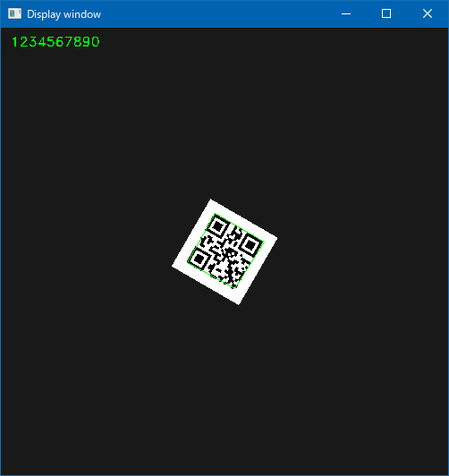

# Barcode Reader on Windows 10 (for C++/WinRT)

## Abstracts

* How to use barcode reader on Windows 10
  * From C++/WinRT console application

## Requirements

* Visual Studio 2022
  * You must install `C++/WinRT` on Visual Studio Installer

[](./images/workload.png)

* Windows 10
* CMake version 3.14 or newer
  * You can install it via `winget install -e --id Kitware.CMake`

## Dependencies

* [Microsoft.Windows.CppWinRT](https://github.com/Microsoft/cppwinrt)
  * MIT License
* [opencv](https://github.com/opencv/opencv)
  * Apache License 2.0 license
* [spdlog](https://github.com/gabime/spdlog)
  * MIT License
* [ZXing-C++](https://github.com/nu-book/zxing-cpp)
  * Apache License 2.0 license

## How to usage?

You must execute `Build.ps1` to build dependencies.

````cmd
$ sources\Demo\bin\x64\Release\Demo.exe testdata\1.png
[info] Input Image Path: testdata\1.png
[info] Read file: 1 ms
[info] Decode image: 2 ms
[info] Read barcode: 13 ms
[info] Please enter key to exit on image window
````

[](./images/result.png)
