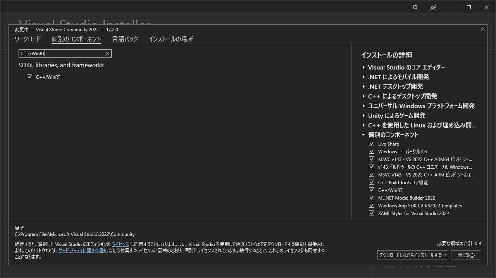

# OCR on Windows 10 (for C++/WinRT)

## Abstracts

* How to use OCR engine embeded on Windows 10
  * From C++/WinRT console application

## Requirements

* Visual Studio 2022
  * You must install `C++/WinRT` on Visual Studio Installer

[](./images/workload.png)

* Windows 10
* CMake version 3.14 or newer
  * You can install it via `winget install -e --id Kitware.CMake`
* Language Pack
  * e.g. Install english language if you want to recognize english text

## Dependencies

* [Microsoft.Windows.CppWinRT](https://github.com/Microsoft/cppwinrt)
  * MIT License
* [spdlog](https://github.com/gabime/spdlog)
  * MIT License

## How to usage?

You must execute `Build.ps1` to build dependencies.

````cmd
$ sources\Demo\bin\x64\Release\Demo.exe ja testdata\ja.png
[info]         Language: ja
[info] Input Image Path: D:\Works\OpenSource\Demo\ComputerVision\08_Windows10_OCR_WinRT\testdata\ja.png
[info] Read file: 40 ms
[info] Decode image: 7 ms
[info] Recognize: 85 ms
[info] 昭 和 ニ 十 - 年 憲 法 日 本 国 憲 法 日 本 国 民 は 、 正 当 に 選 挙 さ れ た 国 会 に お け る 代 表 者 を 通 し て 行 動 し 、 わ れ ら と わ れ ら の 子 孫 の た め に 、 諸 国 民 と の 協 和 に よ る 成 果 と 、 わ が 国 全 土 に わ た っ て 自 由 の も た ら す 恵 沢 を 確 保 し 、 政 府 の 行 為 に よ っ て 再 び 戦 争 の 惨 禍 が 起 る こ と の な い や う に す る こ と を 決 意 し 、 こ こ に 主 権 が 国 民 に 存 す る こ と を 目 言 し 、 こ の 法 を 確 定 す る 。 そ も そ も 国 政 は 、 国 民 の 廠 粛 な 信 託 に よ る も の で あ っ て 、 そ の 権 威 は 国 民 に 由 来 し 、 そ の 権 力 は 国 民 の 代 表 者 が こ れ を 行 使 し 、 そ の 福 利 は 国 民 が こ れ を 享 受 す る 。 こ れ は 人 類 普 遍 の 原 理 で あ り 、 こ の 法 は 、 か か る 原 理 に 基 く も の で あ る 。 わ れ ら は 、 こ れ に 反 す る - 切 の 法 、 法 令 及 び 詔 勅 を 排 除 す る 。 日 本 国 民 は 、 恒 久 の 平 和 を 念 願 し 、 人 間 相 互 の 閂 係  を 支 配 す る 崇 高 な 理 想 を 深 く 自 覚 す る の で あ っ て 、 平 和 を 愛 す る 諸 国 民 の 公 正 と 信 義 に 信 頼 し て 、 わ れ ら の 安 全 と 生 存 を 保 持 し よ う と 決 意 し た 。 わ れ ら は 、 平 和 を 維 持 し 、 専 制 と 隷 従 、 圧 迫 と 偏 狭 を 地 上 か ら 永 遠 に 除 去 し よ う と 努 め て ゐ る 国 社 会 に お い て 、 名 誉 あ る 地 位 を 占 め た い と 思 ふ 。 わ れ ら は 、 全 世 界 の 国 民 が 、 ひ と し く 恐 怖 と 欠 乏 か ら 免 か れ 、 平 和 の う ち に 生 存 す る 権 利 を 有 す る こ と を 確 認 す る 。 わ れ ら は 、 い づ れ の 国 家 も 、 自 国 の こ と の み に 等 念 し て 他 国 を 無 視 し て は な ら な い の で あ っ て 、 政 治 道 徳 の 法 則 は 、 普 遍 的 な も の で あ り 、 こ の 法 則 に 従 ふ こ と は 、 自 国 の 主 権 を 維 持 し 、 他 国 と 対 等 閂 係 に 立 た う と す る 各 国 の き 務 で あ る と 信 す る 。 日 本 国 民 は 、 国 家 の 名 誉 に か け 、 全 力 を あ け て こ の 崇 高 な 理 想 と 目 的 を 達 成 す る こ と を ふ 。
````
