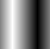
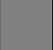

# Resize image with padding

## Abstracts

* What happend when resize mat with 4 byte alignment padding like Windows bitmap
  * OpenCV keep padding of resized mat if specified stride explicitly

## Requirements

### Common

* Powershell 7 or later
* CMake 3.0.0 or later
* C++ Compiler supports C++17

### Windows

* Visual Studio

### Ubuntu

* g++

### OSX

* Xcode

## Dependencies

* [opencv](https://github.com/opencv/opencv)
  * 4.7.0
  * Apache-2.0 License

## How to build?

### OpenCV 4

Go to [OpenCV](..).

````shell
$ pwsh build.ps1 <Debug/Release>
````

Once time you built `opencv4`, you need not to do again.

````shell
$ pwsh build.ps1 <Debug/Release>
````

## How to test?

````bat
$ ./install/linux/bin/Demo
srcMat.steps: 104
dstMat.steps: 52
````

### Before and After resize image 




### Before and After resize image with padding


