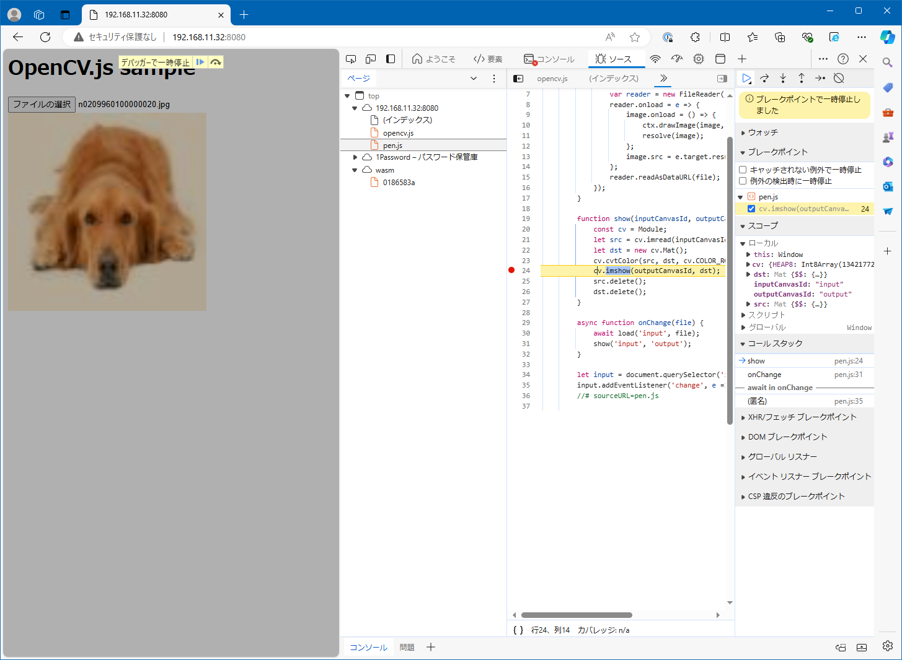

# OpenCV WASM sample

## Abstracts

* Load `opencv.js` and apply image enhancement on web browse
  * Web server is nginx

## Requirements

### Common

* Powershell 7 or later
* Docker

## Dependencies

* [opencv](https://github.com/opencv/opencv)
  * 4.7.0
  * Apache-2.0 License

## How to build?

### OpenCV 4 and Nginx

Go to [OpenCV](..).

````shell
$ pwsh build-wasm.ps1
````

and

````shell
$ pwsh BuildNginx.ps1
````

Once time you built `opencv4` and `nginx`, you need not to do again.

## How to test?

````shell
$ pwsh Run.ps1
````

Then, `nginx` listen `8080`.

