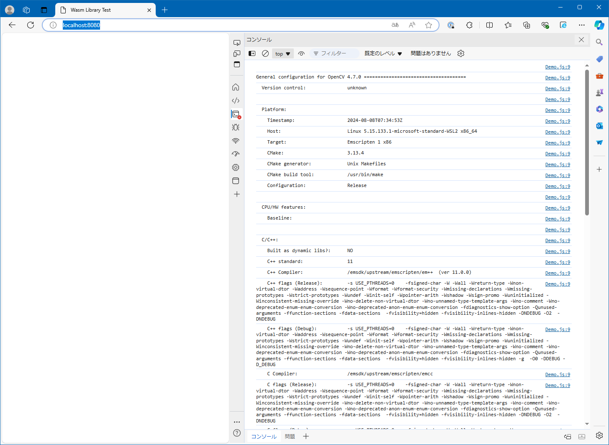

# Combine OpenCV wasm library

## Abstracts

* Link self build of opencv wasm library

## Requirements

### Common

* Powershell 7 or later
* CMake 3.10.0 or later
* Docker
  * If use on Linux, you must add priviledge for user to execute docker without priviledge

## How to build?

### Nginx

````shell
$ pwsh BuildNginx.ps1
````

Once time you built `nginx`, you need not to do again.

Then,

````shell
$ pwsh Build.ps1 <Debug/Release>
````

## How to test?

````shell
$ pwsh Run.ps1
````

Then, `nginx` listen `8080`.

