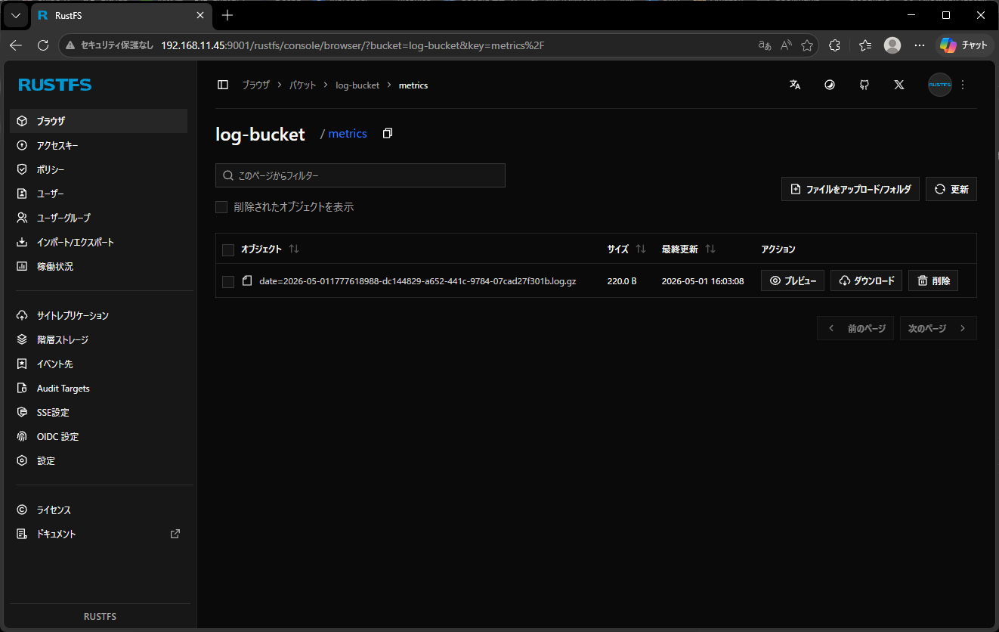
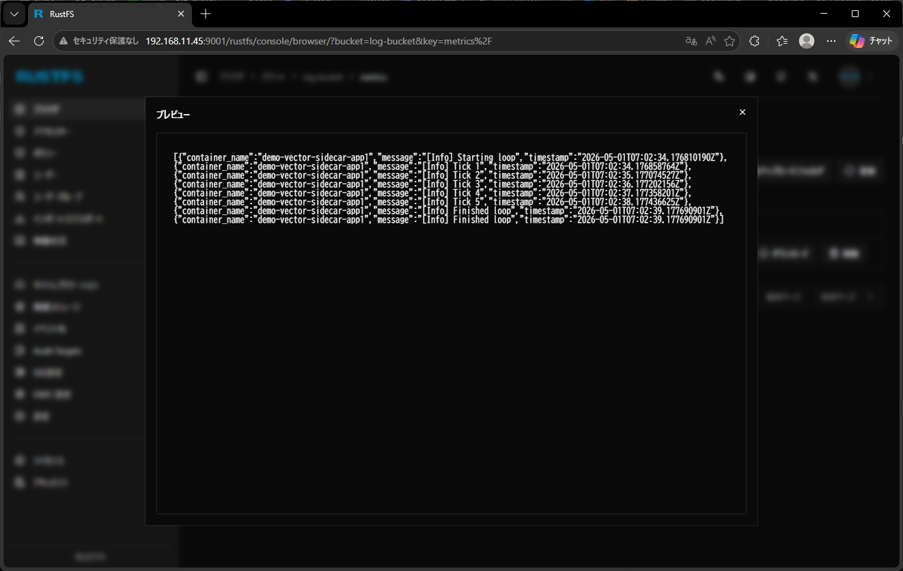

# from docker_logs to AWS S3

## Abstracts

* use `docker_logs` input to collect app's stdin logs via docker log driver
* use `remap` transform to remove unnecessary elements and screen out input containers
* use `aws_s3` sink to publish logs to S3, this demo configures for S3 Compatibility distributed object storage system (e.g. RustFS)

## Dependencies

* [vector](https://github.com/vectordotdev/vector)
  * v0.55.0
  * Mozilla Public License 2.0

#### Warning

As discussed below `[Info] Finished loop` logs are duplicated.
It is sepcification of `docker_logs` input due to lack of checkpoint features.
This issue is discussed on [Add support for end-to-end acknowledgements to all relevant sources #7336](https://github.com/vectordotdev/vector/issues/7336).
And this support is just development on [feat(docker_logs source): add checkpointing #24869](https://github.com/vectordotdev/vector/pull/24869).

## How to use?

At first, build app image.

````bash
$ pwsh build.ps1
````

Then, lanuch container and show logs.

````bash
$ export AWS_ACCESS_KEY_ID=rustfsadmin
$ export AWS_SECRET_ACCESS_KEY=rustfsadmin
$ export AWS_REGION=ap-northeast-1
$ export S3_ENDPOINT=http://192.168.11.45:9000
$ export S3_BUCKET_NAME=log-bucket
$ docker compose up -d
````



