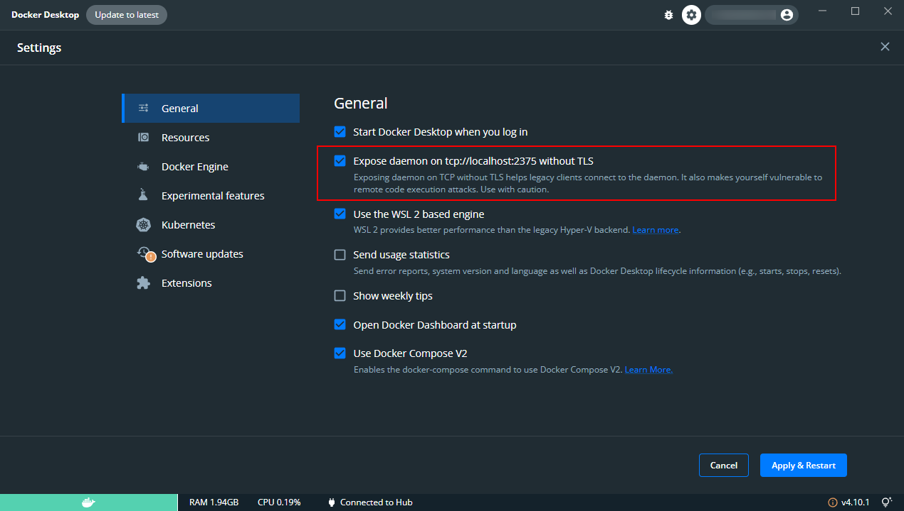

# Test Docker Remote API

## Abstacts

* How to control docker container via Docker Remote API

## Requirements

* .NET 6.0 SDK
* PowerShell Core 6.2 or later
* docker and docker-compose

## Dependencies

* [Docker.DotNet](https://github.com/dotnet/Docker.DotNet)
  * MIT License
* [NLog](https://github.com/NLog/NLog)
  * BSD-3-Clause License

## How to use

### Enable Docker Remote API

For windows, 



For linux,


### Run demo program

For windows,

````shell
$ dotnet run -c Release --project sources\Demo\Demo.csproj -- tcp://localhost:2375dotnet run -c Release --project sources\Demo\Demo.csproj -- tcp://localhost:2375
2022-08-21 10:09:25.3153 [INFO ] CONTAINER ID: sha256:d6ef2c07430b8acc76603104e07cf1b906f09f630b13211fba6ea4117ddda791, Name: /docker-sample-nginx
2022-08-21 10:09:25.3536 [INFO ] CONTAINER ID: sha256:7cd80bdefc6bc7ba661f1a208ba172b9f0e7ce7adfe665c4539ca81a9c82d311, Name: /docker-sample-aspnet6
````