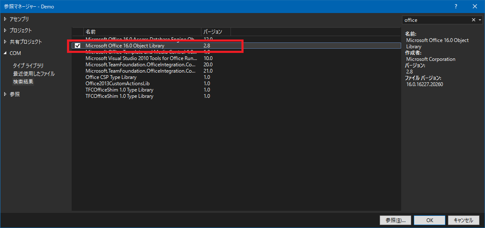
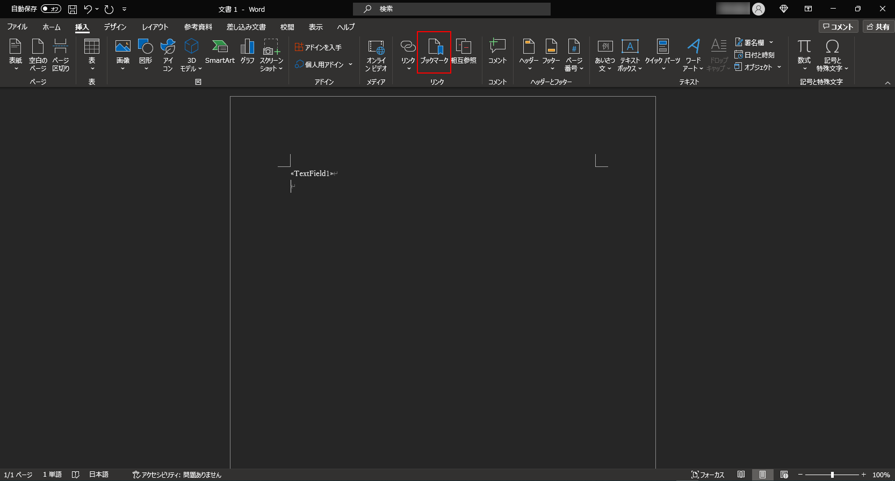

# Insert Image

## Abstracts

* Insert image into work file according to template doc file

## Requirements

* .NET Framework 4.8
* Word for Microsoft 365
  * I tested only for it but this program would work file for other versions of Microsoft Word.

## Dependencies

* [NLog](https://github.com/NLog/NLog)
  * BSD-3-Clause License

## How to usage?

1. Add reference `Microsoft Office 2016 Object Library`



2. You can check `Microsoft.Office.Core` and `Microsoft.Office.Interop.Word` in reference node


3. Build and run with command line arguments

````cmd
$ cd 01_InsertImage
$ sources\Demo\bin\Release\Demo.exe template.docx "This is word!!" test.png test.docx
````

Word template file is 


This template has 

### Merge field


### Bookmarks




4. Rresult is


