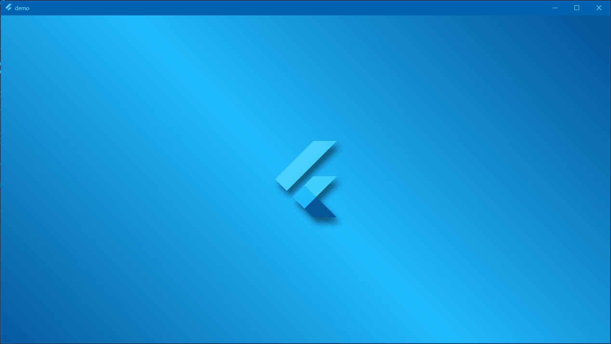

# Login

## Abstracts

* Add login feature to [02_SplashScreen](../02_SplashScreen)
* Usage of page navigation
* Adjust input fields according to device size
* username and password are **admin/p@ssword**

## Dependencies

### Splashsceen image

* [Flutter Logo , Computer, , , Background, and HD wallpaper](https://www.pxfuel.com/en/desktop-wallpaper-tzydn)

## Screenshots

|Windows|Android|iOS|
|---|---|---|
||||

## WidgetTest with coverage

#### Windows 

In administrator console,

````bat
$ choco install lcov
$ choco install strawberryperl
````

After this,

````bat
$ flutter test --coverage
$ mkdir coverage\html
$ "C:\Strawberry\perl\bin\perl.exe" "C:\ProgramData\chocolatey\lib\lcov\tools\bin\genhtml" coverage\lcov.info -o coverage\html
````

#### osx

````sh
$ brew install lcov
````

After this,

````bat
$ flutter test --coverage
$ genhtml coverage/lcov.info -o coverage/html
````