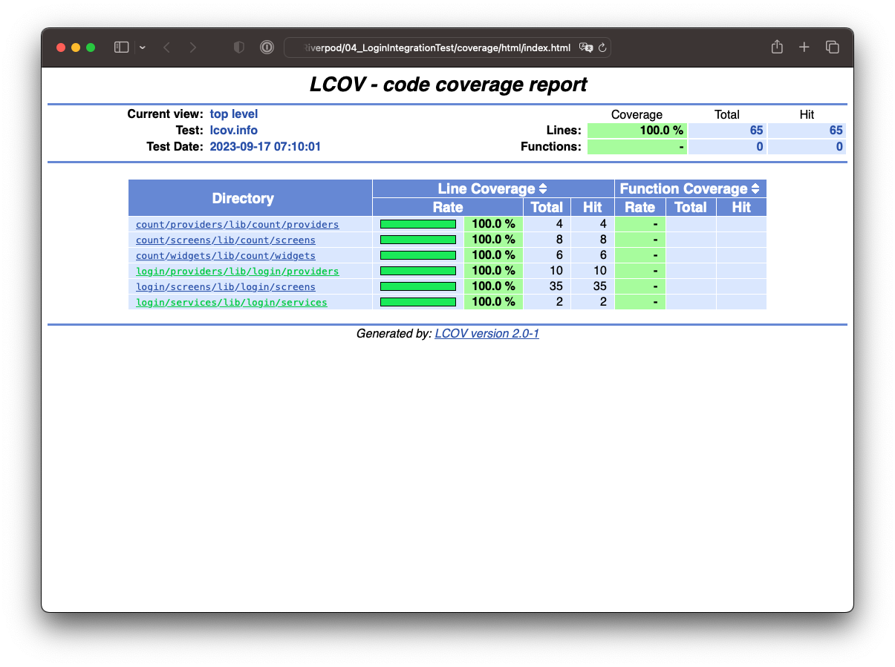

# Integration Test for Login

## Abstracts

* Add integration test and unit test to [03_Login](../03_Login)

## WidgetTest with coverage

#### Windows 

In administrator console,

````bat
$ choco install lcov
$ choco install strawberryperl
````

After this,

````bat
$ flutter test --coverage
$ mkdir coverage\html
$ "C:\Strawberry\perl\bin\perl.exe" "C:\ProgramData\chocolatey\lib\lcov\tools\bin\genhtml" coverage\lcov.info -o coverage\html
````

#### osx

````sh
$ brew install lcov
````

After this,

````bat
$ flutter test --coverage
$ genhtml coverage/lcov.info -o coverage/html
````



## Integration Test

````bat
$ flutter test integration_test
````

or you can speicify `--profile` option for non-web application

````sh
$ flutter drive --profile --driver=test_driver/integration_test.dart \
                          --target=integration_test/main_test.dart
````