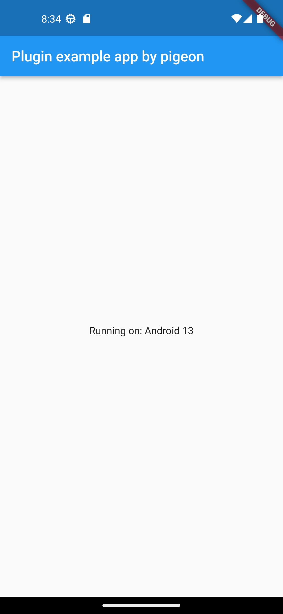

# Pigeon example

## Abstracts

* Rewrite all code of flutter plugin example by using `pigeon`

## Dependencies

* [pigeon](https://pub.dev/packages/pigeon)
  * BSD-3-Clause license

## Screenshots

|windows|
|---|
||

|ios|android|
|---|---|
|||
