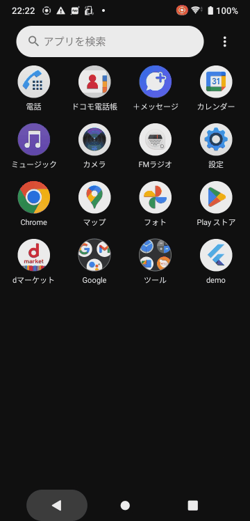

# QC code scanner example

## Abstracts

* Rewrite all code of flutter plugin example by using `mobile_scanner`

## Requirements

### Android

* Android SDK 33

##### Warning

`mobile_scanner` has some issue.

* [Build failed when updating to latest version](https://github.com/juliansteenbakker/mobile_scanner/issues/729)

## Screenshots

|ios|android|
|---|---|
|||
