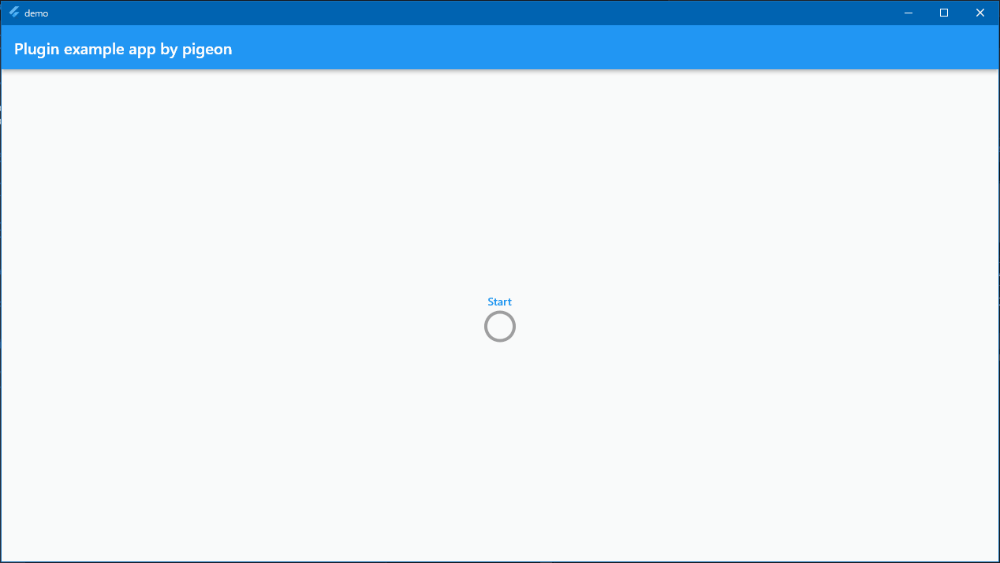
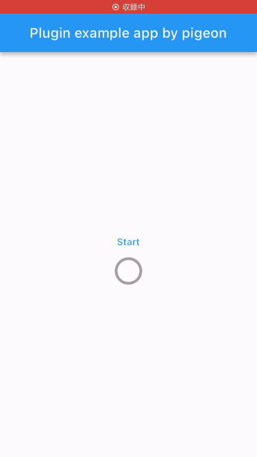
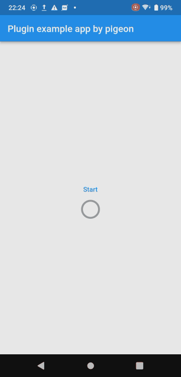

# Pigeon example using 2-Way communication

## Abstracts

* Use `FlutterApi` to communicate from platform code to flutter code
  * Create thread in platform side and platform code send message to flutter side to notify progress

## Dependencies

* [pigeon](https://pub.dev/packages/pigeon)
  * BSD-3-Clause license

## Screenshots

|windows|
|---|
||

|ios|android|
|---|---|
|||
