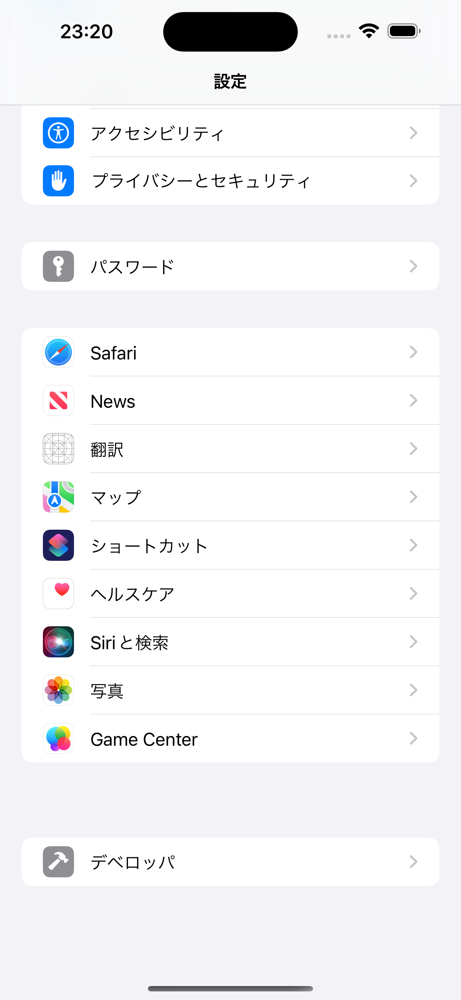
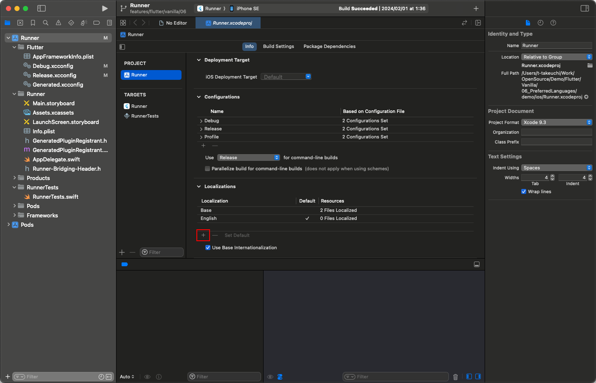
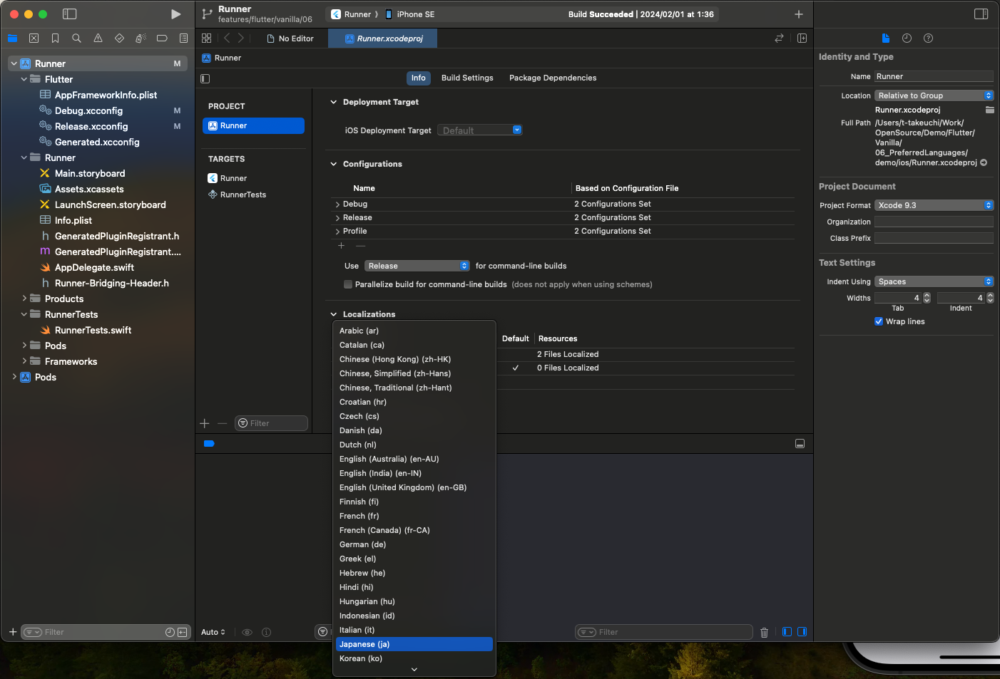
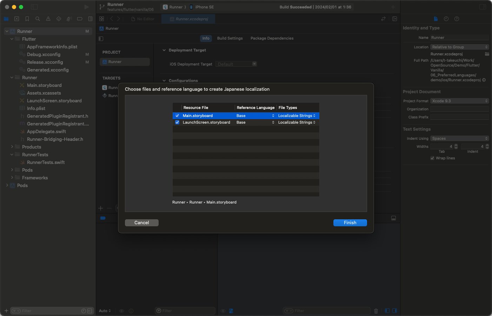
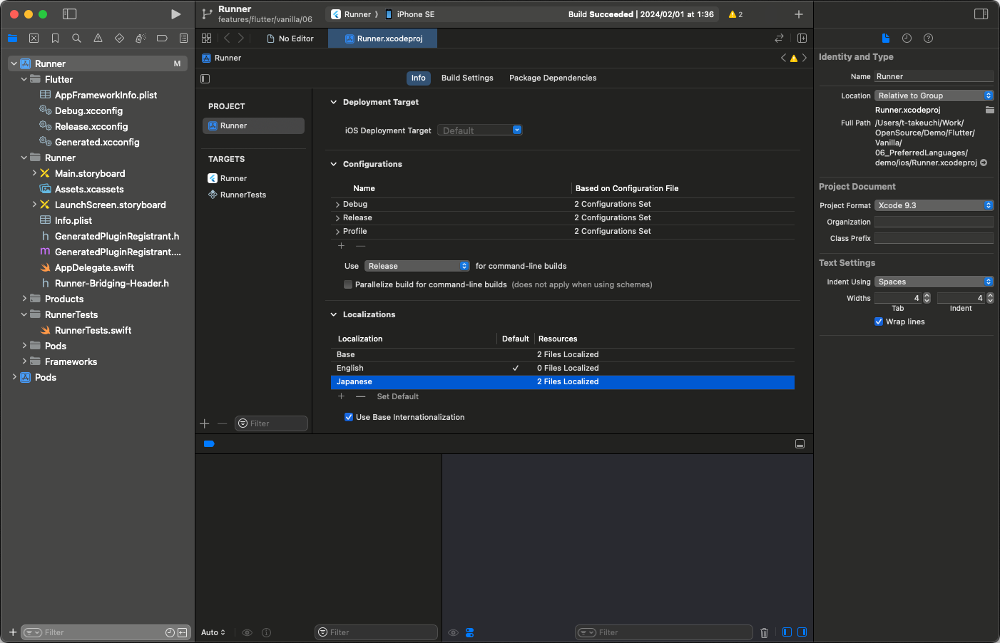
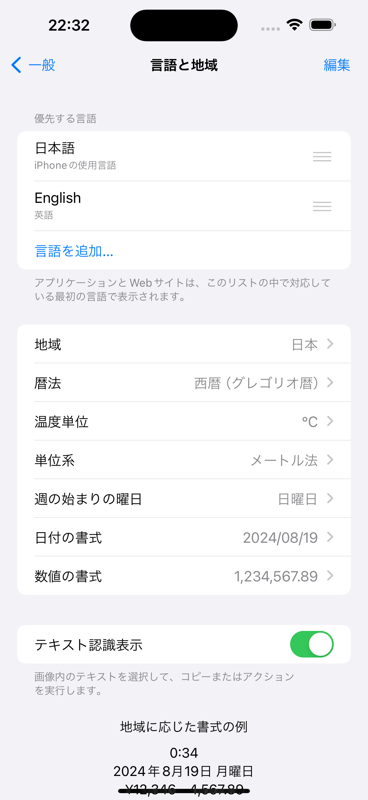
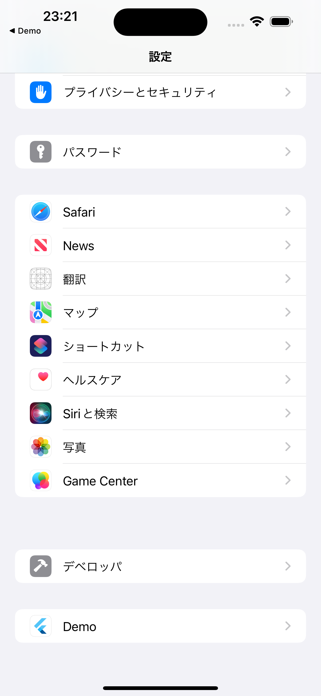
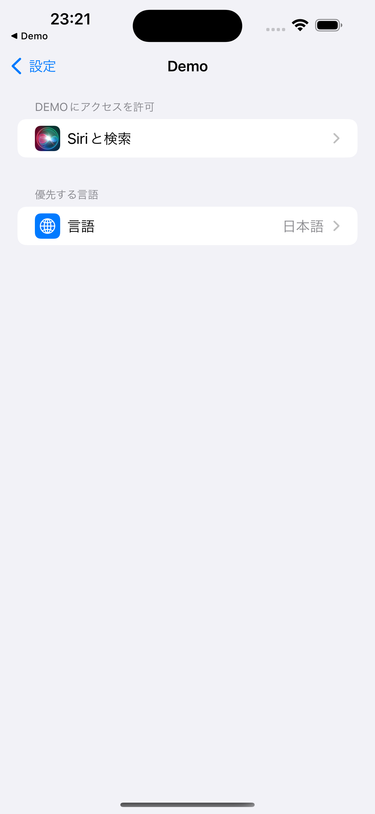
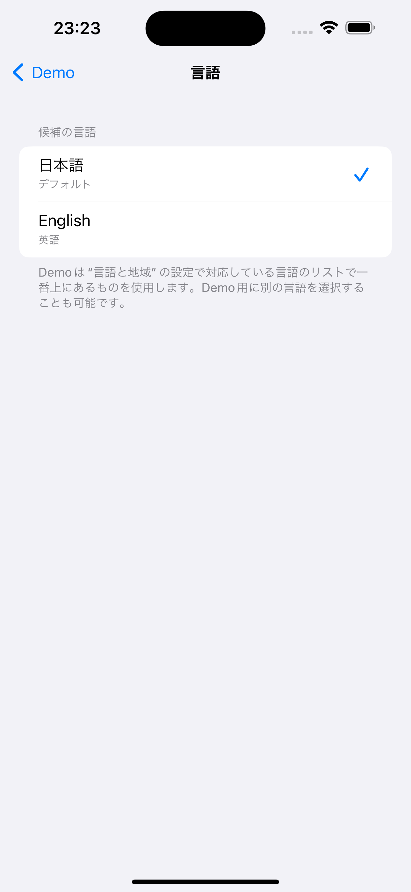
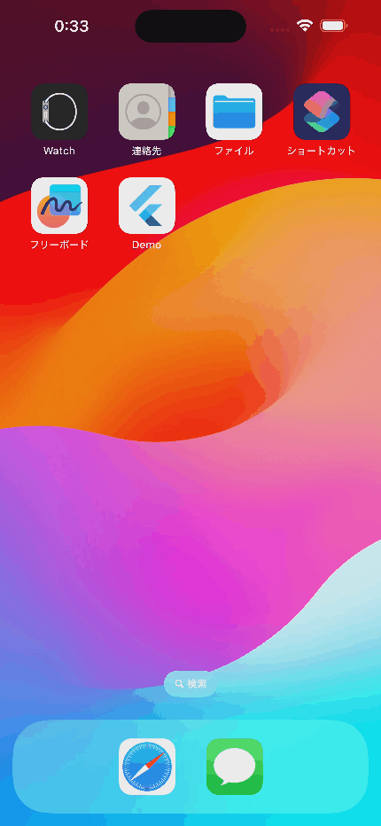

# Select Preferred Language for iOS

## Abstracts

* How to show 'Preferred Language' setting in application setting page

## Dependencies

* [app_settings](https://github.com/spencerccf/app_settings)
  * MIT license

## Detailed description 

Basically, `Prefered Language` of application setting is not present.

It will appear after a following conditions is met

* Added support multiple localizations to application and added preferred languages to iOS

At first, add some localizations supported by application.
For example, adding Japanese

Then, add some preferred languages supported by system.
For example, added English

After this, application setting will be shown.

And it contains `Preferred Language`.

In conclusion, if developper hope to have user change application language from application setting, developer must add multiple localizations languagae in xcode.
In other words, application setting page will not be present even if user add preferred languages onln in iOS.

## Screenshots

