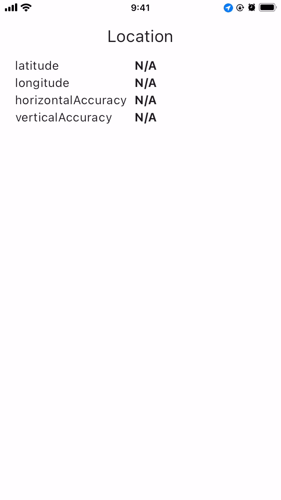
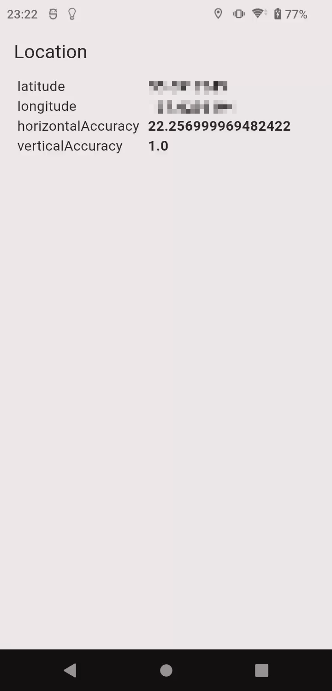

# location

## Abstracts

* How to use `location` and show gps value

## Dependencies

* [latitude](https://github.com/Lyokone/flutterlocation)
  * MIT license

## Screenshots

|iOS|Android|
|---|---|
|||