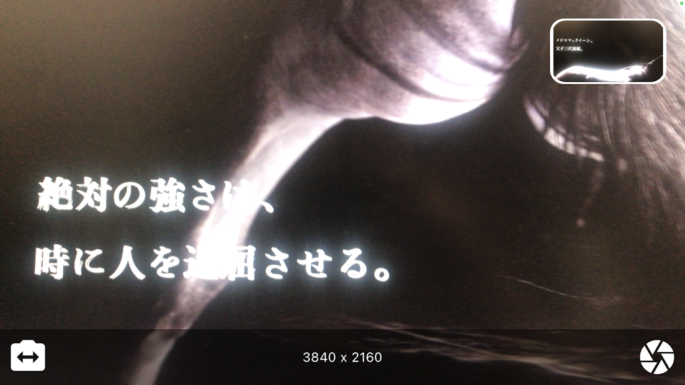
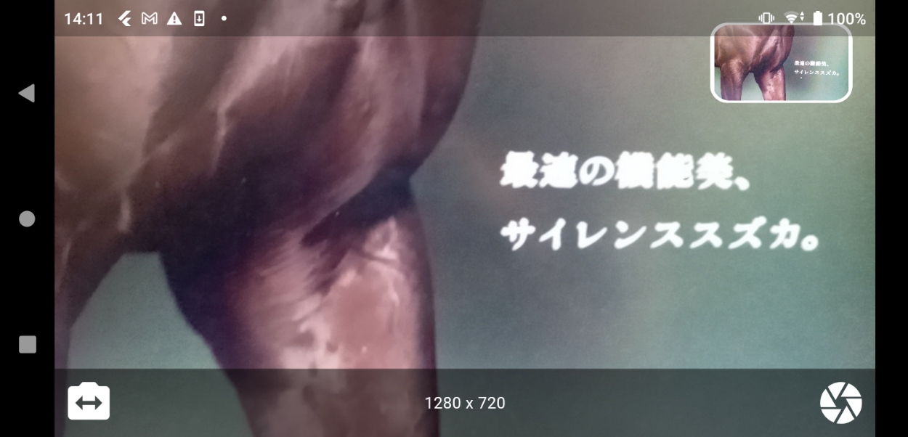

# Camera

## Abstracts

* How to take photo by using `camera` package
  * Support to change front/rear camera
* How to check EXIF by using `exif` package

## Dependencies

* [camera](https://github.com/flutter/packages/tree/main/packages/camera/camera)
  * BSD-3-Clause license
* [exif](https://github.com/bigflood/dartexif)
  * MIT license
* [image_size_getter](https://github.com/CaiJingLong/dart_image_size_getter/tree/master/library)
  * Apache-2.0 license
* [path_provider](https://github.com/flutter/packages/tree/main/packages/path_provider/path_provider)
  * BSD-3-Clause license

## Screenshots

#### iOS

This image is from [Mejiro McQueen in 1991's Tenno Sho (Spring)](https://dadada.works/jra-g1-2011/)

#### Android

This image is from [Silence Suzuka in 1998's Takarazuka Kinen](https://dadada.works/jra-g1-2011/)