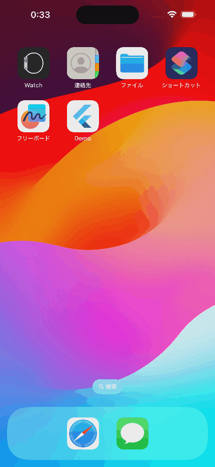

# Select Preferred Language for iOS

## Abstracts

* How to show 'Preferred Language' setting in application setting page

## Dependencies

* [camera](https://github.com/flutter/packages/tree/main/packages/camera/camera)
  * BSD-3-Clause license
* [native_device_orientation](https://github.com/rmtmckenzie/flutter_native_device_orientation)
  * MIT  license

## Detailed description 

Basically, `Prefered Language` of application setting is not present.

## Screenshots

