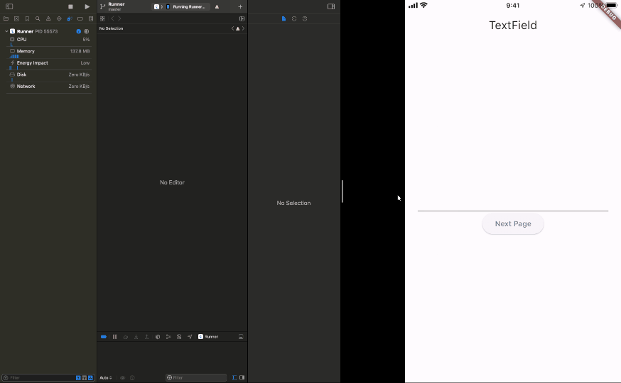

# TextField and TextFormField consume CPU resource

## Abstracts

* `TextField` and `TextFormField` consume CPU when focused
  * But `cursorOpacityAnimates` is `false`, this problem goes away

## Screenshots

When widget get focus, usage of CPU raise up rapidly.
But `cursorOpacityAnimates` is false, usage of CPU keeps low.

#### cursorOpacityAnimates is true

#### cursorOpacityAnimates is false

