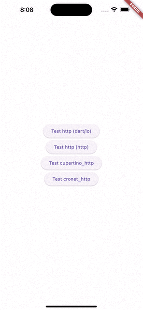

# Behavior of insecure HTTP

## Abstracts

* Check behavior of http library for insecure http
  * GET for [http://example.com](http://example.com)
  * `App Transport Security` for iOS and `usesCleartextTraffic` for Android are not configured so insecure http connection could be not allowed

## Requirements

* Android
  * API Level 33 or later
* iOS
  * 11.0 or later

## Dependencies

* [cupertino_http](https://github.com/dart-lang/http/tree/master/pkgs/cupertino_http)
  * 1.3.0
  * BSD-3-Clause License
* [cronet_http](https://github.com/dart-lang/http/tree/master/pkgs/cronet_http)
  * 1.2.0
  * BSD-3-Clause License
* [http](https://github.com/dart-lang/http/tree/master/pkgs/http)
  * 1.2.0
  * BSD-3-Clause License

## Screenshots

#### iOS

|iOS|Android|
|---|---|
|||