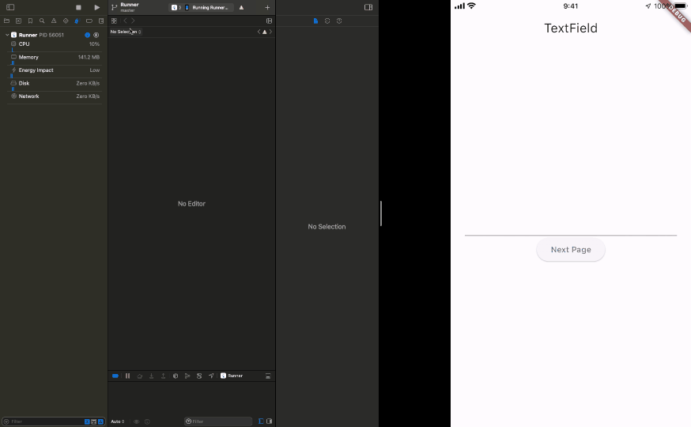

# TextField and TextFormField consume CPU resource

## Abstracts

* `TextField` and `TextFormField` consume CPU when focused
  * But `cursorOpacityAnimates` is `false`, this problem goes away

## Dependencies

* [firebase_core](https://github.com/firebase/flutterfire/tree/master/packages/firebase_core/firebase_core)
  * BSD-3-Clause license
* [firebase_messaging](https://github.com/firebase/flutterfire/tree/master/packages/firebase_messaging/firebase_messaging)
  * BSD-3-Clause license

flutter pub add firebase_messaging

## Screenshots

When widget get focus, usage of CPU raise up rapidly.
But `cursorOpacityAnimates` is false, usage of CPU keeps low.

#### cursorOpacityAnimates is true



#### cursorOpacityAnimates is false


````sh
$ python -m pip install google-auth requests
````