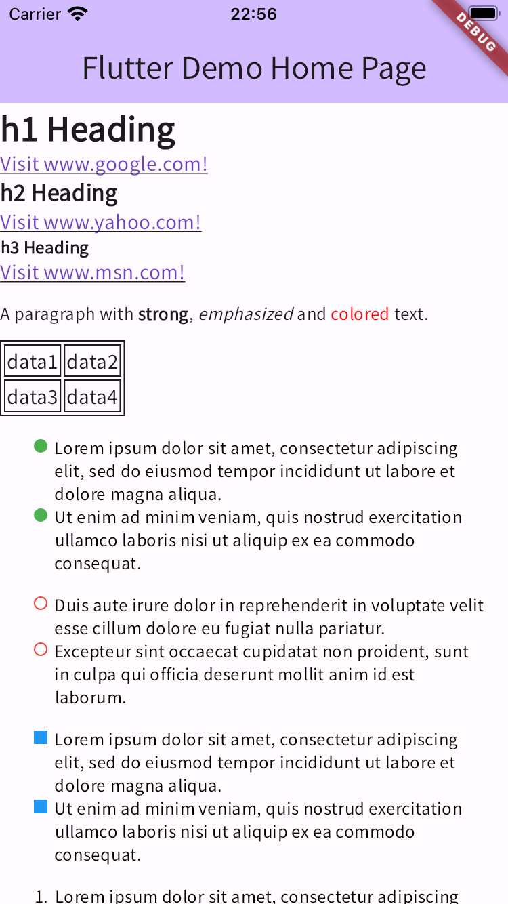
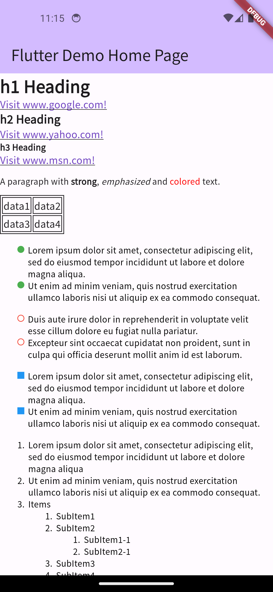

# Render HTML as widget

## Abstracts

* Reder html content into widget
  * Use `flutter_widget_from_html` package
    * Hook `h1`, `h2`, `h3`, `li`, `ul` and `ol` tags. Especially, customize color of symbol of list.

## Dependencies

* [flutter_widget_from_html](https://github.com/daohoangson/flutter_widget_from_html)
  * 0.15.2
  * MIT License
* [uuid](hhttps://github.com/Daegalus/dart-uuid)
  * 4.5.1
  * MIT License

#### Assets

* [Noto Sans Japanese](https://fonts.google.com/noto/specimen/Noto+Sans+JP?query=noto+san)
  * SIL Open Font License 1.1

## How to use?

|iOS|Android|
|---|---|
|||