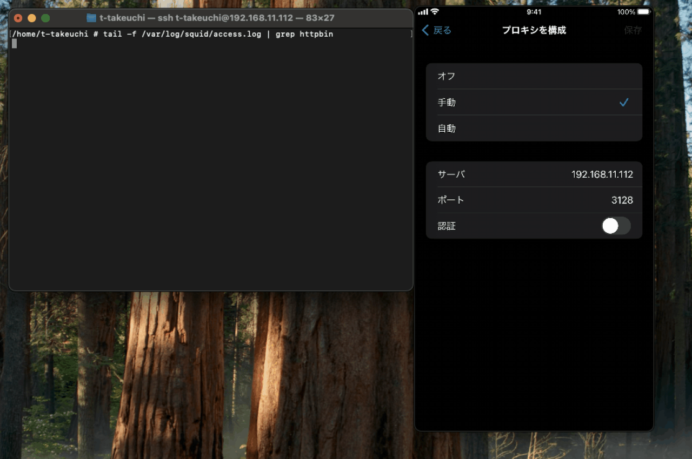

# HTTP Proxy

## Abstracts

* Flutter ignore system proxy so use `http_proxy` packages.
  * [App ignores proxy settings #26359](https://github.com/flutter/flutter/issues/26359)
    * But most of packages like `http_proxy` does not support PAC (Proxy Auto-Configuration).

## Requirements

* Android
  * minSdkVersion is 21
* iOS
  * 12.0 or later

## Dependencies

* [http_proxy](https://github.com/wslaimin/http_proxy)
  * 1.2.2
  * MIT License

## Screenshots

|OS|Screenshot|
|---|---|
|iOS||
|Android||
