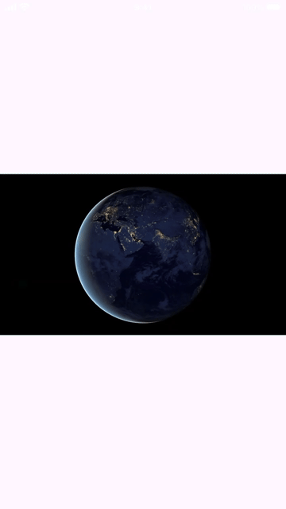
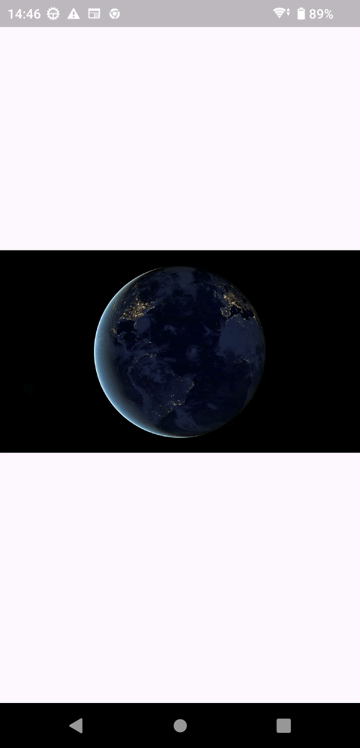

# Video Player

## Abstracts

* How to play asset video data
  * Video data is converted from WebM format

## Dependencies

* [video_player](https://pub.dev/packages/video_player)
  * BSD-3-Clause license
  * 2.9.3

#### Data

* [assets/file_example_WEBM_1920_3_7MB.mp4](assets/file_example_WEBM_1920_3_7MB.mp4)
  * No license
  * [https://file-examples.com/wp-content/storage/2020/03/file_example_WEBM_1920_3_7MB.webm](https://file-examples.com/wp-content/storage/2020/03/file_example_WEBM_1920_3_7MB.webm)
    * The origin of this video is https://pixabay.com/videos/world-earth-nasa-planet-globe-2/

## How to use?

You must run [assets/convert.sh](./assets/convert.sh) before build project.

#### iOS

This movie is from [2020's Tokyo Yushun (a.k.a Japanese Derby) (G1) | Contrail | JRA Official](https://www.youtube.com/watch?v=IhEX_AByG3A) as RTSP streaming

#### Android

This image is from [https://media.w3.org/2010/05/sintel/trailer.mp4](https://media.w3.org/2010/05/sintel/trailer.mp4)