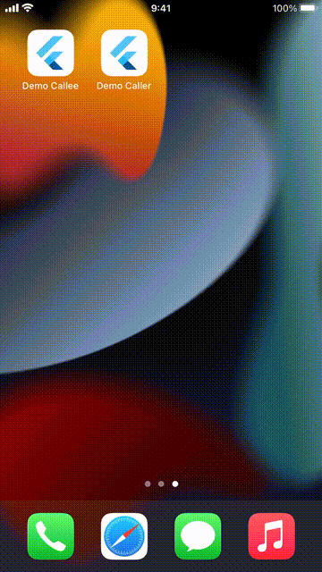
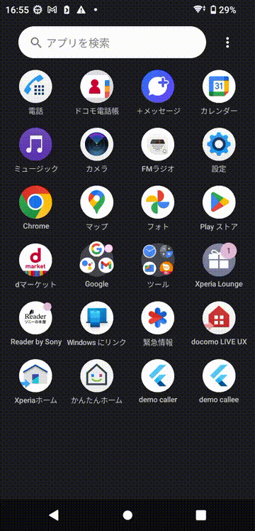

# Universal Link

## Abstracts

* Launch app from another app

## Dependencies

* [app_links](https://pub.dev/packages/app_links)
  * Apache 2.0 License
  * 6.4.0
* [url_launcher](https://pub.dev/packages/url_launcher)
  * BSD-3-Clause License
  * 6.3.1

#### Data

* [assets/file_example_WEBM_1920_3_7MB.mp4](assets/file_example_WEBM_1920_3_7MB.mp4)
  * No license
  * [https://file-examples.com/wp-content/storage/2020/03/file_example_WEBM_1920_3_7MB.webm](https://file-examples.com/wp-content/storage/2020/03/file_example_WEBM_1920_3_7MB.webm)
    * The origin of this video is https://pixabay.com/videos/world-earth-nasa-planet-globe-2/

## How to use?

You must run [assets/convert.sh](./assets/convert.sh) before build project.

#### Screenshot

|iOS|Android|
|---|---|
|||