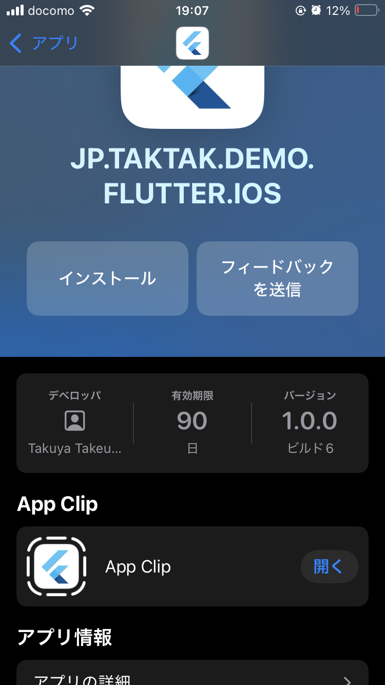

# App Clip

## Abstracts

* How to introduce App Clip into existing parent iOS app
  * You can refer [Adding an iOS App Clip target](https://docs.flutter.dev/platform-integration/ios/ios-app-clip).

## Requirement

* iOS 16.0 or later
  * for increasing binary size to 15 MB

## Dependencies

* N/A

## Note

We ignore the following steps

* [Step 3 - Remove unneeded files](https://docs.flutter.dev/platform-integration/ios/ios-app-clip#step-3-remove-unneeded-files)
* [Step 5 - Share code and assets](https://docs.flutter.dev/platform-integration/ios/ios-app-clip#step-5-share-code-and-assets)
* [Step 7 - Integrate Flutter](https://docs.flutter.dev/platform-integration/ios/ios-app-clip#step-3-remove-unneeded-files)
* [Step 8 - Integrate plugins](https://docs.flutter.dev/platform-integration/ios/ios-app-clip#step-8-integrate-plugins)

## How to use?

At first, you must create distribute certificate and provisioning profiles.

Open [ios/Runner.xcworkspace](./ios/Runner.xcworkspace) by Xcode.
Then **Product -> Archive**, and **Distribute App**.
Both main and App Clip apps will be published to App Store Connect.

All that is left is distributing app by TestFlight.

#### Screenshot

## Screenshots

