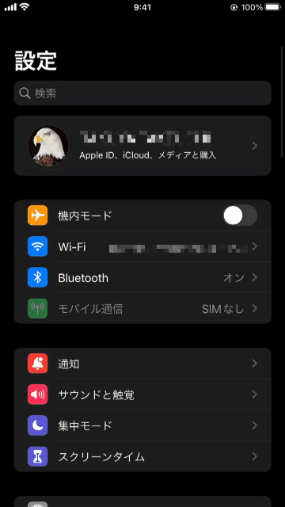

# Credit Card Number AutoFill does not work

## Abstracts

* iOS/Android does not allow fill credit card number even though it is registered into OS build-in browser

## Requirements

* Android
  * minSdkVersion is 21
* iOS
  * 12.0 or later

## Dependencies

N/A

## Screenshots

|iOS|Android|
|---|---|
|||

##### Note

Android does not allow to capture sensitive page like unlock screen and credit card number edit page. Thesse pages becomes black screen.
