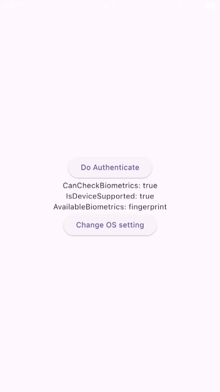
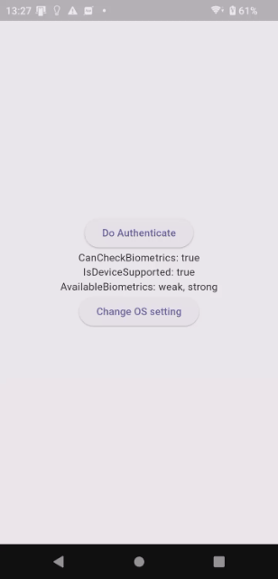
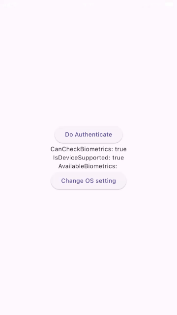
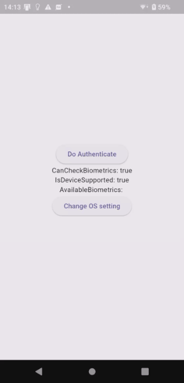

# Try Biometric Authentication

## Abstracts

* Use biometric authentication if device/os supports

## Requirements

* Android
  * minSdkVersion is 21
* iOS
  * 12.0 or later

## Dependencies

* [app_settings](https://github.com/spencerccf/app_settings)
  * MIT License
  * 6.1.1
* [local_auth](https://github.com/flutter/packages/tree/main/packages/local_auth/local_auth)
  * BSD-3-Clause License
  * 2.3.0

## Screenshots

##### Enrolled fingerprints

|iOS|Android|
|---|---|
|||

##### Enrolled no fingerprints

|iOS|Android|
|---|---|
|||

##### Note

Android does not allow to capture sensitive page like unlock screen and credit card number edit page. Thesse pages becomes black screen.
