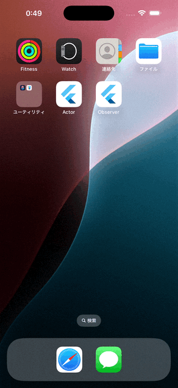
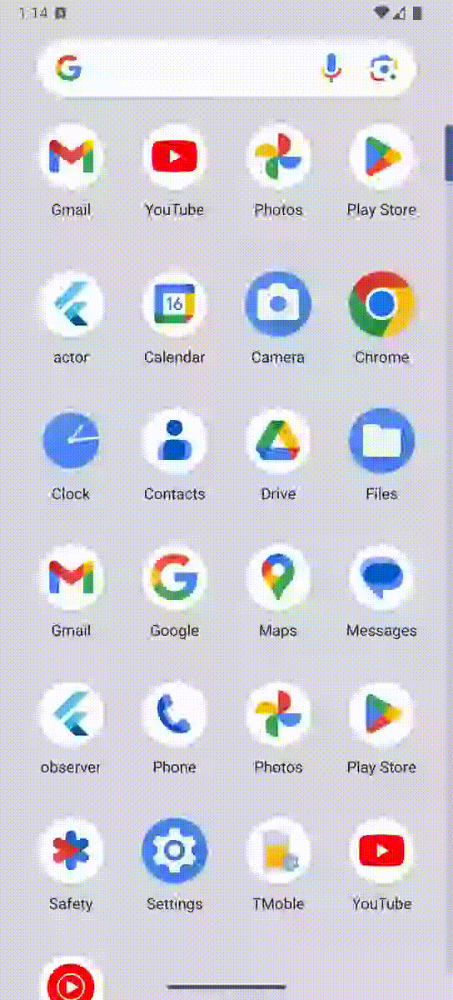

# Custom URL Scheme

## Abstracts

* Use custom url scheme to launch app from app
  * This demo uses `yourcustomscheme://`

## Requirements

* Android
  * minSdkVersion is 21
* iOS
  * 12.0 or later

## Dependencies

* [url_launcher](https://pub.dev/packages/url_launcher)
  * BSD-3-Clause License
  * 6.3.2

## Screenshots

|iOS|Android|
|---|---|
|||
