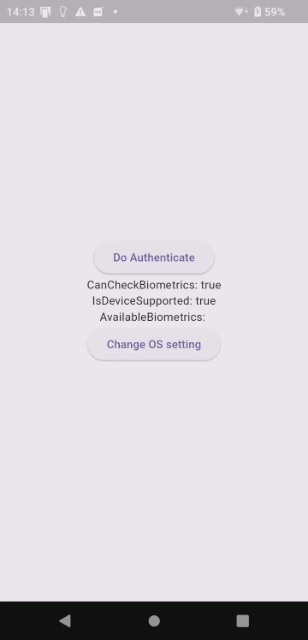

# Try Biometric Authentication

## Abstracts

* Use biometric authentication if device/os supports

## Requirements

* Android
  * minSdkVersion is 21
* iOS
  * 15.0 or later

## Dependencies

* [firebase_analytics](https://github.com/firebase/flutterfire/tree/main/packages/firebase_analytics/firebase_analytics)
  * BSD-3-Clause License
  * 12.0.0
* [firebase_core](https://github.com/firebase/flutterfire/tree/main/packages/firebase_core/firebase_core)
  * BSD-3-Clause License
  * 4.0.0

## How to build?

You shall execute `flutterfire configure` because [android/app/google-services.json](android/app/google-services.json) and [ios/Runner/GoogleService-Info.plist](ios/Runner/GoogleService-Info.plist) are ignored in this repository.
Please refer [Step 2: Configure your apps to use Firebase](https://firebase.google.com/docs/flutter/setup?platform=ios&hl=en#configure-firebase).

## Screenshots

##### Enrolled fingerprints

|iOS|Android|
|---|---|
|||

##### Enrolled no fingerprints

|iOS|Android|
|---|---|
|||
